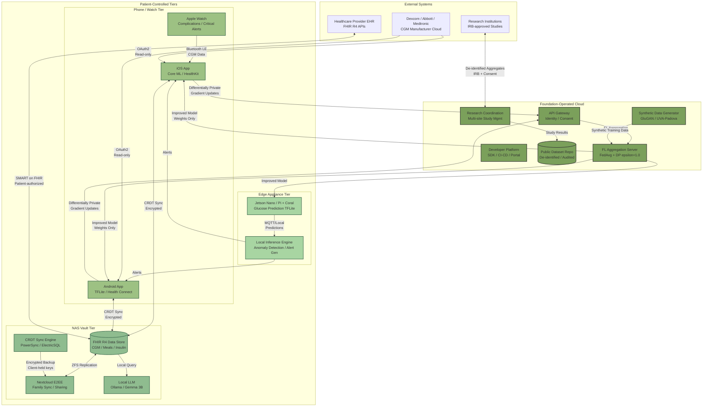

# OpenDiabetic Foundation: Core Strategy Update

## Privacy-First Diabetic Compute Infrastructure

---

# Executive Summary

**OpenDiabetic Foundation is a privacy-first diabetic compute foundation.** It is not a content publisher, a supply seller, or a diabetes app company. The foundation owns and operates the compute layer — local data vaults, edge AI inference, federated learning coordination, synthetic data pipelines, and developer toolkits — that powers DiabeticOS, DiabeticMOS, LocalDiabetic, research workloads, and lifestyle support systems. Its foundational principle is non-negotiable: diabetic data is never harvested. Local ownership, local storage, explicit user consent, and privacy-first compute are structural commitments encoded in nonprofit charter, technical architecture, and governance design. Every finding in this document converges on a single conclusion: the diabetic community desperately needs trusted compute infrastructure that it cannot build alone, and the window for establishing it is approximately two to three years.

## The Case in Six Findings

**First, the PHR market is expanding toward $26 billion but failing the patients who need it most.** The global PHR software market was valued at $6.42 billion in 2024 and is projected to reach $25.92 billion by 2035, growing at 13.5% CAGR^1^. Yet a mere 2% of patients have used an app to consolidate data across multiple provider portals^2^. This 98% non-adoption rate is not a technology problem — it is a trust and usability crisis. Patients with five providers maintain five separate portal accounts. Epic Systems dominates with 42% hospital market share and 180 million MyChart users^3^, but its proprietary control reinforces the fragmentation that PHRs are meant to solve. Microsoft HealthVault and Google Health already proved that manual-entry PHRs without provider integration are a failed model^4^. The gap between market growth and patient adoption is where OpenDiabetic operates: providing FHIR-native auto-ingestion with diabetes-specific clinical value that generic PHRs cannot deliver.

**Second, the trust deficit in health data is not an abstract concern — it is a market-shaping force that directly determines adoption.** In 2024, 742 large healthcare data breaches exposed over 276 million patient records, with the Change Healthcare attack alone affecting 192.7 million individuals^5^ ^6^. The average healthcare breach cost $7.42 million in 2025, exceeding every other industry for the fourteenth consecutive year^7^. Behind headline breaches lies a quieter economy: health data brokers operate a $7.3 billion industry, with IQVIA capturing 93% of U.S. prescriptions daily and medical records selling for $100–$250 on criminal markets — ten times the price of stolen credit cards^8^. The consequences for diabetes are specific: CGM data receives no HIPAA protection when held by device manufacturers^9^. Against this backdrop, 95% of patients express concern about data breaches, 94% want companies held legally accountable for health data use, and 92% believe opt-in consent should be mandatory^10^ ^11^. Privacy-first design is not merely an ethical stance — it is strategically necessary for adoption.

**Third, the daily burden of diabetes creates an overwhelming cognitive load that technology has largely failed to address.** People with diabetes make more than 180 health-related decisions every day^12^. The total recommended daily self-care time exceeds 4 hours for adults and 5 hours for children^13^. Alarmingly, 79% of people with diabetes report experiencing burnout, and 75% of those burned-out patients stop or interrupt treatment^1^. CGM alarm fatigue affects 26–50% of users, with discontinuation rates reaching 12–62%^14^. Despite the proliferation of apps, only 8% of people with type 2 diabetes use any digital support for self-management^15^. Patients feel "burdened with device complexities" and overwhelmed by data volume^8^. The evidence is unambiguous: patients do not need another data dashboard. They need decision reduction — an intelligent layer that processes raw data into actionable guidance, automates supply tracking, prepares clinical visits, and handles family communication with minimal cognitive overhead.

**Fourth, the open-source diabetes ecosystem has proven clinical efficacy but faces a volunteer sustainability crisis that threatens its survival.** The #WeAreNotWaiting movement — encompassing Nightscout (39,000+ community members), Tidepool (600,000+ users), Loop, AndroidAPS, and Trio — has generated landmark clinical evidence. The CREATE trial demonstrated that open-source automated insulin delivery users spent 3 hours 21 minutes more per day in target glucose range^16^. An international consensus statement endorsed by multiple diabetes organizations has recognized the legitimacy of open-source AID^17^. Yet approximately 30,000 users depend on software maintained almost entirely by uncompensated volunteers^17^ ^18^. Core developers maintain critical infrastructure with no financial compensation, working a "double-shift" of full-time employment plus open-source maintenance^19^ ^20^. Studies of FOSS communities show high burnout rates, with many volunteers leaving within a year^19^. Tidepool's 2024 announcement that it needed to "wean ourselves off of grant and donation support" signals the broader reality: without sustainable infrastructure funding, the most innovative diabetes technology ecosystem in the world risks attrition^21^.

**Fifth, privacy-preserving compute has crossed the threshold from research curiosity to clinical viability — but real-world deployment remains rare.** Federated learning for diabetes prediction has achieved 91–97% accuracy in peer-reviewed studies, with clustering-based approaches reaching precision of 0.93 and recall of 0.96 for glucose prediction^13^ ^1^. Edge AI hardware — NVIDIA Jetson Nano at $99 and Raspberry Pi with Coral TPU at approximately $150–200 — can run glucose inference at sub-50ms latency, with TensorFlow Lite LSTM models achieving RMSE of 16 ± 4.7 mg/dL and 98.9% of predictions in clinically safe Clarke Error Grid zones^22^. The EXAM study demonstrated federated learning across 20 institutions on four continents achieving AUC greater than 0.92 for predicting COVID-19 oxygen requirements without sharing any patient data^23^. Yet of 107 reviewed healthcare FL studies, only 10 reported real-world deployments in distributed clinical settings^24^. The research infrastructure exists; the coordination infrastructure to deploy it does not.

**Sixth, a sustainable nonprofit model that never harvests patient data is demonstrably viable.** Five revenue pillars — grassroots donations (30–40%), foundation grants (25–35%), industry membership (20–25%), hosted services (10–15%), and endowment income (5–10%) — provide structural diversification that no single payer can dominate. Wikimedia Foundation generates $185 million annually from millions of small donors^25^. The Linux Foundation achieves $311 million in revenue from 3,000+ industry members who collectively realize a 6x return on their infrastructure investment^26^. Tidepool has already proven that nonprofit, open-source diabetes technology can achieve FDA clearance and serve 600,000+ users^27^ ^28^. The model works. What is missing is the compute foundation purpose-built for the diabetic community's specific needs.

## Strategic Imperatives

**The temporal window is limited and closing.** Three converging forces create an approximately two-to-three-year first-mover opportunity that will not recur. The European Health Data Space (EHDS), in force since March 2025, establishes the strongest patient data rights framework globally — free access, portability, opt-out, and data restriction rights^29^. The U.S. 21st Century Cures Act's information blocking rules, with penalties up to $1 million per violation, now require FHIR API access nationwide^30^. Local-first technology — CRDT-based sync, edge AI hardware under $200, and zero-knowledge cloud architectures — has matured to production readiness. Whoever builds the trusted patient-side infrastructure to receive, store, and govern data flowing through these newly opened channels will define the category for the next decade.

**OpenDiabetic must become the trusted compute infrastructure that the community cannot build alone.** Volunteer developers have produced remarkable tools — Nightscout for real-time CGM sharing, xDrip+ for universal sensor reading, AndroidAPS for automated insulin delivery — but they lack the resources to build foundational infrastructure: federated learning coordination for cross-institutional research, synthetic data generation for safe model development, certified local vaults for patient-controlled data, and a developer platform that lets builders focus on patient value rather than compliance plumbing. These are the compute-layer capabilities that the foundation provides, governed by a 501(c)(3) data trust with fiduciary duties to people with diabetes as beneficiaries, overseen by a board that includes patients as voting members with equal authority.

**The measure of success is burden reduction, not user count or revenue.** A person with diabetes should spend less time thinking about their condition because OpenDiabetic infrastructure exists — not more time navigating apps and data streams. The 180 daily decisions should become fewer. The 4 hours of recommended self-care should become more achievable. The 79% burnout rate should decline. The 98% of patients who have never consolidated their cross-provider data should find it effortless — and find that the consolidated record remains under their control, on their hardware, governed by their consent. Trust is built not through privacy policies that patients never read, but through organizational structures that make data exploitation structurally impossible and technical architectures that keep raw glucose data on local devices where no breach, subpoena, or organizational failure can reach it.

**This document presents the complete strategy across eight chapters.** Chapter 1 maps the market forces — a $26 billion PHR market with 98% consolidation failure, a trust deficit measured in hundreds of millions of breached records, and regulatory mandates that are opening data flows without providing patient-side infrastructure. Chapter 2 details the four-tier compute architecture — phone/watch, edge appliance, NAS vault, and cloud coordination — with zero-knowledge guarantees and CRDT-based local-first sync. Chapter 3 establishes the seven-principle Data Ownership Doctrine, from "no harvesting" as a structural commitment to research opt-in with differential privacy standards. Chapter 4 presents the DiabeticOS SDK, eight core modules, eight agent templates, and compute credits for qualifying open-source builders. Chapter 5 outlines the Research Compute Strategy: three-tier compute credits, federated learning coordination via PySyft and Flower, synthetic data pipelines, and a public-good compute ledger. Chapter 6 describes DiabeticOS as a lifestyle operating system designed for daily simplicity — decision reduction, alarm fatigue prevention, emergency support with QR/NFC sharing, and post-hospital recovery coordination. Chapter 7 presents the five-pillar nonprofit revenue model, governance architecture, and sustainability milestones from Year 1 seed funding through Year 5 scale at 50,000 users and a $10 million endowment. Chapter 8 synthesizes the strategic conclusion: a closing first-mover window, an unreplicable trust moat, and the imperative to act now.

---

# 1. Diabetic Compute Infrastructure Market Analysis

Three converging forces shape the market for privacy-preserving diabetic compute infrastructure: a PHR market growing toward $26 billion yet reaching only 2% of patients, a systemic collapse of trust in health data stewardship, and edge AI technologies that make privacy-preserving computation clinically viable for the first time. Amplified by the most aggressive regulatory push for patient data rights in history, these forces create a unique window for OpenDiabetic to establish a new category of patient-owned, privacy-first diabetic compute. This chapter maps each force and its strategic implications.

## 1.1 Patient-Owned Health Data and the PHR Market

### 1.1.1 A Growing Market with a Participation Crisis

The global Personal Health Record (PHR) software market was valued at $6.42 billion in 2024 and is projected to reach $25.92 billion by 2035, growing at a 13.52% compound annual growth rate (CAGR). An alternative estimate from Research Nester places the 2025 base higher at $11.97 billion, projecting $28.86 billion by 2035 at 9.2% CAGR.^1^North America commands 47.9% of this market, driven by high EHR penetration, federal interoperability mandates, and rising patient demand for digital access.^12^Integrated or "tethered" PHRs — directly linked to provider EHRs with automatic data updates — hold the largest revenue share at 42.15%, while cloud-based deployment dominates overall with more than 60% of installations.^13^Yet this expanding market conceals a striking participation crisis. While 65% of Americans accessed their online medical records in 2024 (up from just 25% in 2014), and 99% of hospitals now offer electronic record viewing,^14^a mere **2% of patients** have used an app to consolidate data across multiple provider portals.^2^The vast majority of patients log into separate portals for each provider, manually reconciling fragmented records — if they attempt reconciliation at all. This 98% non-adoption rate for portal-aggregation tools represents both the market's defining failure and OpenDiabetic's core opportunity.

**Table 1: PHR Market Size Estimates and Key Segments (2024–2035)**

| Segment / Source | 2024/2025 Value | 2035 Projection | CAGR | Scope Definition |
|---|---|---|---|---|
| Market Research Future (integrated PHR) | $6.42B ^1^| $25.92B | 13.52% | Patient portals, health analytics, EHR-PHR integration |
| Research Nester (integrated PHR) | $11.97B ^1^| $28.86B | 9.2% | Broader digital health platform categories |
| Grand View Research (standalone PHR) | $47.40M ^31^| $105.30M (2033) | 10.61% | Standalone PHR software only |
| North America share | 47.9% ^12^| — | — | Regional market dominance |
| Integrated/tethered PHR share | 42.15% ^13^| — | — | Largest architecture segment |
| Cloud deployment share | 60%+ ^13^| — | — | Dominant delivery model |
| Patient portal-aggregation adoption | 2% ^2^| — | — | Critical adoption gap |

The 136-fold gap between the standalone ($47.40M) and integrated ($6.42B) estimates is analytically significant. The standalone figure measures consumer-direct PHR products — a category that has consistently failed. The integrated figure captures tethered portals and EHR-connected functionality with automatic data ingestion. The implication is direct: any viable patient-controlled health record **must** auto-integrate with provider systems via FHIR APIs. Manual-entry standalone PHRs are a proven dead end.

*Figure 1: Global PHR Software Market Projections. The integrated PHR market (including tethered portals and EHR-connected platforms) is projected to grow from $6.4–12.0B in 2024–2025 to $25.9–28.9B by 2035. The standalone PHR segment (dashed line, near zero) illustrates the failure mode of manual-entry systems without provider integration. Source: Market Research Future (2025), Research Nester (2025), Grand View Research (2025).*

### 1.1.2 Cloud Dominance Meets Rising Demand for Data Control

Cloud deployment's 60%+ share reflects healthcare's default architecture: patient data on vendor-controlled servers, accessed through web portals and apps, governed by privacy policies few patients read.^13^Epic alone maintains 325 million patient records across 3,620 hospitals.^3^But patients can view their data without ever possessing or controlling it.

Two regulatory watersheds challenge this model. GDPR classifies health data as "special category" data requiring explicit consent and mandates portability under Article 20.^29^The U.S. 21st Century Cures Act's information blocking rules, enforced with penalties up to $1 million per violation, require providers to make records available through standardized FHIR APIs.^30^The technical infrastructure for patient data extraction now exists. What remains missing is patient-side software to receive, store, and govern that data.

### 1.1.3 Epic's Dominance and the Fragmentation Paradox

Epic Systems generated $5.7 billion in revenue in 2024 (up 16% year-over-year), controls 42.3% of the U.S. acute care hospital market, and operates with zero debt and estimated EBITDA margins above 30%.^3^Its MyChart patient portal serves more than 180 million active users. Epic has also been designated as a Qualified Health Information Network (QHIN) under TEFCA, positioning it as a central node in nationwide health data exchange.^32^This concentration creates a paradox. Any aggregator must integrate with Epic's APIs, yet Epic's proprietary control reinforces the fragmentation PHRs are meant to solve. A patient with five providers may hold five separate portal accounts. Half of portal users maintain multiple accounts, generating frustration and abandonment.^33^The result is fragmentation at a higher level — the 2% consolidation adoption rate reflects patient resignation, not satisfaction.

### 1.1.4 The Failed Models: Lessons from HealthVault and Google Health

Microsoft HealthVault (2007–2019) and Google Health (2008–2011) share three fatal flaws relevant to any new PHR entrant: **reliance on manual data entry**, **lack of integration with provider EHRs**, and **absence of actionable health insights** justifying the maintenance effort.^4^Google's brand power could not overcome the friction of manual entry; Microsoft's twelve-year persistence could not compensate for the lack of provider integration.

OpenDiabetic's architecture must avoid both traps by building FHIR-native auto-ingestion from all patient portals and delivering diabetes-specific clinical value — glucose trend analysis, insulin dosing support, care coordination — that generic PHRs could never provide.

## 1.2 The Trust Deficit in Health Data

### 1.2.1 Breaches at Scale: The Quantified Erosion of Patient Trust

Healthcare data breaches have reached epidemic proportions. In 2024, 742 large breaches (each affecting 500 or more individuals) were reported to the HHS Office for Civil Rights, exposing over 276 million patient records — equivalent to 82% of the U.S. population.^5^The Change Healthcare ransomware attack alone affected 192.7 million individuals, with total breach costs reaching $3.09 billion.^6^From 2009 to 2024, a cumulative 6,759 breaches exposed the protected health information of 847 million individuals.^5^The cost per incident is equally staggering. The average healthcare data breach cost $7.42 million in 2025, exceeding every other industry for the fourteenth consecutive year.^7^Ransomware attacks hit 67% of healthcare organizations in 2024 — nearly double the 34% rate recorded in 2021 — and 29% of breached organizations reported increased patient mortality as a direct consequence.^34^**Table 2: Healthcare Data Breach Landscape (2024–2025)**

| Metric | Value | Source |
|---|---|---|
| Large breaches reported to OCR (2024) | 742+ ^5^| HHS OCR / HIPAA Journal |
| Records exposed (2024) | 276+ million ^5^| HHS OCR |
| Change Healthcare breach affected | 192.7 million ^6^| HIPAA Journal |
| Average breach cost (2025) | $7.42M ^7^| IBM / Sprinto |
| Healthcare orgs hit by ransomware (2024) | 67% ^34^| Sophos / Faxsipit |
| Breached orgs reporting increased mortality | 29% ^34^| Ponemon Institute |
| Cumulative breaches 2009–2024 | 6,759 ^5^| HHS OCR |
| Cumulative records exposed 2009–2024 | 847 million ^5^| HHS OCR |

Against this backdrop, 95% of patients report concern about potential data breaches or leaks of their medical records.^10^The breach epidemic is not merely a cybersecurity issue — it is a **market-shaping force** that determines whether patients adopt digital health tools at all. Near-universal breach concern creates demand for architectures that structurally minimize data exposure, not promises of better security for the same centralized model.

### 1.2.2 The Invisible Economy: Health Data Brokers

Behind headline breaches lies a quieter, systemic threat. The health data broker industry is valued at $7.3 billion, growing 8.5% annually toward $13.8 billion by 2031.^8^IQVIA alone captures 93% of U.S. prescriptions daily.^35^Medical records sell for $100–$250 on criminal markets — ten times the price of stolen credit cards.^8^A 2019 Duke University investigation found brokers willing to sell mental health data — including names and addresses of individuals with depression, anxiety, and PTSD — for as little as $2,500.^36^Legally, sales of de-identified health data under HIPAA can occur without patient consent or transparency, and even over a patient's explicit objection.^15^The implications for diabetes are specific. Continuous glucose monitor (CGM) data — readings every 1–5 minutes, 24 hours a day — receives **no HIPAA protection** when held by device manufacturers.^9^The same data protected in a clinician's hands becomes unprotected commercial property the moment it syncs to a manufacturer's cloud. Dexcom, Abbott, and Medtronic privacy policies all permit use of "de-identified" CGM data for purposes beyond patient care. In 2022, the Italian Data Protection Authority fined a U.S. diabetes monitoring company EUR 45,000 for unintentionally disseminating personal data of 2,000 glucose-monitoring patients through a single employee error.^37^### 1.2.3 Regulatory Enforcement and the Erosion of Health Tech Trust

Regulatory enforcement is beginning to catch up with data exploitation practices, but the pattern of fines reveals an industry systematically prioritizing data monetization over patient consent. Health apps including GoodRx, BetterHelp, and Cerebral were fined over $20 million collectively by the FTC for sharing user health data with Facebook and Google without adequate consent.^38^A Financial Times investigation found that 79% of popular health websites share tracking data with third parties including Google, Amazon, Facebook, and Oracle — often passing drug names entered into search fields and symptoms typed into questionnaires directly to advertising platforms.^39^The diabetes app ecosystem reflects this pattern at scale. Approximately 60% of analyzed diabetes apps request potentially dangerous permissions, 28.4% lack any privacy policy, and 40% contain advertising — with the free apps' business model largely dependent on sharing or selling user data to unknown third parties.^40^At least 61% of apps tested automatically transfer data to Facebook the moment a user opens the app, regardless of whether the user has a Facebook account.^41^### 1.2.4 Patient Demand for Accountability: The Consent Imperative

Patient attitudes have hardened in response. Ninety-four percent of patients want companies held legally accountable for uses of their health data; 93% want app developers to be transparent; 80% want the ability to opt out of data sharing; and more than 75% want explicit opt-in consent before any company uses their data.^42^Ninety-two percent of Americans believe explicit opt-in consent should be mandatory for sharing health data.^43^Yet 81% of Americans mistakenly believe that health data collected by digital apps is protected under HIPAA — a fundamental misunderstanding that means patients cannot make informed decisions about data sharing.^44^**Table 3: Federated Learning Accuracy Benchmarks for Diabetes Applications**

| Framework / Study | Task | Key Metric | Result | Privacy Preservation |
|---|---|---|---|---|
| FLWCO (2025) | Diabetes prediction (96,146 instances) | Accuracy | 97.27% ^45^| Federated — no data centralization |
| Clu-FDL (2025) | Glucose prediction | Precision / Recall / F1 | 0.93 / 0.96 / 0.95 ^46^| Federated + patient clustering |
| Clu-FDL (2025) | Glucose prediction | RMSE | 11.08 ± 1.77 mg/dL ^46^| Federated + patient clustering |
| FedGlu (2025) | Glycemic excursion detection | Improvement over local models | 35% ^47^| Personalized FL |
| Explainable FL (2026) | Diabetes prediction | Accuracy / F1 / ROC-AUC | 0.92 / 0.93 / 0.94 ^48^| Federated + explainability |
| TensorFlow Lite + LSTM (2021) | Glucose prediction (Raspberry Pi) | Clarke Error Grid A+B | 98.9% ^49^| On-device inference |
| FL for diabetic retinopathy | Retinopathy screening | AUC range | 0.93–0.96 ^45^| Cross-institutional FL |

This table demonstrates a critical finding: federated learning (FL) has achieved clinical-grade accuracy for diabetes-related prediction tasks **without requiring patient data to leave local devices**. The accuracy range of 91–97% matches or exceeds centralized approaches, while eliminating the single-point-of-failure architecture that makes centralized databases attractive breach targets. The implication is not merely technical — it is strategic. Privacy-preserving computation is no longer a research curiosity; it is a production-viable alternative to data centralization that directly addresses the trust deficit documented in the preceding sections.

## 1.3 Edge AI and Privacy-Preserving Compute Trends

### 1.3.1 Healthcare Edge AI: A $47 Billion Market by 2035

The healthcare edge AI market is projected to grow from $8.21 billion in 2025 to $47.23 billion by 2035, at a CAGR of approximately 19%.^50^This growth is driven by three factors directly relevant to OpenDiabetic: the need for real-time glucose prediction with sub-second latency, the demand for processing to occur without continuous cloud connectivity, and increasing regulatory pressure to minimize data centralization.

Federated learning sits at the intersection of these trends. FLWCO achieves 97.27% accuracy on a 96,146-instance diabetes dataset.^45^FedGlu improves glycemic excursion detection by 35% over local-only models.^47^Clu-FDL achieves precision of 0.93 and recall of 0.96 for glucose prediction with RMSE of just 11.08 ± 1.77 mg/dL.^46^These accuracies are achieved without patient data leaving local devices — model updates, not raw data, traverse the network.

Edge hardware has matured for local inference. TensorFlow Lite LSTM models on a Raspberry Pi achieve 98.9% of predictions within clinically acceptable Clarke Error Grid Zones A and B, with inference latency under 71 milliseconds.^49^NVIDIA's Jetson Nano ($99, 5–10W) provides GPU-accelerated inference for multimodal models integrating CGM, heart rate, and activity data.^51^Edge latency of 1–10 milliseconds compares favorably to 50–200+ milliseconds for cloud round-trips.^52^### 1.3.2 Key Privacy-Preserving Technologies: A Layered Architecture

Three complementary technologies form the foundation of privacy-preserving diabetic compute. **Differential privacy** (DP) provides mathematical privacy guarantees by adding calibrated noise to model updates. The privacy guarantee is controlled by the epsilon (ε) parameter, with smaller values providing stronger privacy.^53^Model utility degrades significantly at ε ≈ 1, where noise can cause convergence failure, but maintains clinically acceptable performance at ε ≈ 10.^54^No universal epsilon standard exists — Dwork recommends 0.01 to ln 3, while healthcare deployments typically use ε between 1 and 5.^53^**Homomorphic encryption** (HE) enables computation on encrypted data without decryption. Fully Homomorphic Encryption using the CKKS scheme achieves accuracy comparable to plaintext (99.56% in sleep apnea detection), but training takes 10.8x longer and ciphertexts are 18x larger.^55^Hardware acceleration is closing this gap: GPU offloading achieves 1.5–10.5x latency reductions. For OpenDiabetic, HE applies most practically to secure aggregation of federated model updates rather than real-time patient-side inference.

**Secure multi-party computation** (SMPC) allows multiple parties to compute on combined data while keeping inputs private, but faces high computational overhead.^56^The most effective architectures combine all three: FL for distributed training, DP for noise injection, and SMPC or HE for secure aggregation — a defense-in-depth approach that maximizes privacy without sacrificing clinical utility.

### 1.3.3 The Deployment Gap: From Simulation to Clinical Reality

Despite compelling accuracy benchmarks, real-world FL deployment in healthcare remains rare. Of 107 reviewed FL healthcare studies, only 10 reported actual distributed clinical implementations — fewer than 9%.^57^The majority (78 of 107) used custom-designed rather than open-source frameworks, and 95 followed centralized FL topologies that still rely on a coordinating server.^57^The EXAM study represents the most successful large-scale deployment to date, involving 20 institutions across four continents to predict COVID-19 oxygen requirements, achieving AUC above 0.92 with 38% improved generalizability over local models.^58^The MELLODDY project demonstrated cross-pharma collaboration at unprecedented scale, training models on 2.6 billion data points across 10 pharmaceutical companies without sharing raw data.^59^The gap between simulation and deployment is OpenDiabetic's strategic opening. Commercial healthcare FL platforms including Owkin's Substra, tracebloc, and Apheris are emerging, but none are diabetes-specific, open-source, or operated by nonprofit entities structurally incapable of data harvesting.^60^The field is transitioning from research to "FL-as-a-service" platforms, and the foundation that provides the infrastructure layer for diabetes-specific federated studies — without the appearance of data monetization — occupies a trust position that no commercial competitor can replicate.

## 1.4 Regulatory Landscape Shaping the Market

### 1.4.1 The European Health Data Space: Strongest Patient Rights Framework Globally

The European Health Data Space Regulation (EU 2025/327) entered into force on March 26, 2025, establishing the most ambitious patient data rights framework in the world.^61^The EHDS grants patients the right to access their health data immediately, free of charge, and in an interoperable format; to share it with any healthcare provider; to restrict access to parts of their data; to correct errors; to see who accessed their data; and to opt out of secondary use for research or policy.^61^The regulation anticipates savings of nearly EUR 11 billion over ten years through improved health data utilization and projects 20–30% growth in the digital health market by 2033.^62^The EHDS creates both an obligation and an opportunity for OpenDiabetic. Any diabetes data platform operating in the EU must be EHDS-compliant. But early compliance also becomes a competitive differentiator — particularly because the EHDS mandates cross-border interoperability through HL7 FHIR and standardized formats, directly supporting the foundation's architecture of patient-controlled, standards-based data vaults. The EU xShare project's "Yellow Button" concept for one-click health data export provides a template that OpenDiabetic can adapt as a "Diabetes Data Export" tool.^63^### 1.4.2 The 21st Century Cures Act: Information Blocking and API Access

In the United States, the 21st Century Cures Act's information blocking rules have fundamentally altered the power dynamic between patients and providers. With penalties of up to $1 million per violation, the rules require healthcare providers, health IT developers, and health information networks to make electronic health information available to patients without delay or additional cost.^30^The Trusted Exchange Framework and Common Agreement (TEFCA), established under the Cures Act, is now operational with Qualified Health Information Networks (QHINs) actively exchanging data.^64^The Cures Act's patient API requirements create the technical foundation for automatic data ingestion into patient-controlled PHRs. By 2024, 81% of hospitals enabled patient access via apps and 70% used FHIR-based apps.^14^Epic's participation as a QHIN means its 180 million MyChart users can theoretically port their data to third-party applications. The practical reality lags behind the policy intent — the 2% consolidation adoption rate demonstrates that infrastructure alone does not drive behavior — but the legal and technical rails for patient data extraction are now in place.

### 1.4.3 State Privacy Laws: A Rising Floor of Protection

Thirteen U.S. states have enacted comprehensive consumer data privacy laws as of 2024, with more pending.^65^While most exempt protected health information held by covered entities under HIPAA, they **do not** exempt health data held by non-HIPAA entities such as health apps, CGM manufacturers, and wellness platforms.^65^This distinction is critical for diabetes technology: CGM data, exercise logs, and nutrition tracking held by app developers fall outside HIPAA and are increasingly covered by state privacy laws.

Washington State's My Health My Data Act (MHMDA), passed in April 2023, is the most significant for health data specifically. It fills critical gaps in HIPAA by extending protections to health data collected by entities not bound by HIPAA, including apps, websites, and small businesses.^17^The MHMDA prohibits the sale of health data without signed consumer authorization and makes geofencing around healthcare facilities for data collection or advertising purposes illegal.^66^For OpenDiabetic, this patchwork of state laws creates compliance complexity but also validates the foundation's privacy-by-design approach: a local-first architecture that never collects patient data centrally is inherently compliant with laws that restrict data transfer and sale.

### 1.4.4 FDA Guidance: GMLP Principles and the Absence of FL-Specific Rules

The FDA has not issued federated learning-specific guidance, but its Good Machine Learning Practice (GMLP) principles — jointly developed with Health Canada and the UK's MHRA — are directly applicable.^67^The 10 GMLP guiding principles cover multi-disciplinary expertise, representative training datasets, independent test sets, model design for clinical workflow integration, human-AI team performance evaluation, clinical validation, transparency, and post-deployment monitoring.^67^By 2023, the FDA had authorized 692 AI/ML-enabled medical devices, a 20-fold increase over the mean annual approval rate between 1995 and 2015.^68^The absence of FL-specific guidance creates regulatory uncertainty but also a first-mover advantage. OpenDiabetic can engage FDA early to establish regulatory templates for FL-based diabetes AI — following the precedent set by Tidepool Loop, which in January 2023 became the first open-source automated insulin delivery algorithm to receive FDA 510(k) clearance.^69^The Tidepool precedent is particularly relevant because it proved that open-source, community-developed diabetes algorithms can achieve regulatory approval using real-world evidence rather than traditional clinical trials. For OpenDiabetic, simultaneous pursuit of FDA engagement, GDPR privacy-by-design compliance, and EHDS alignment creates a "triple compliance" signal that no existing diabetes platform can match.

---

The conditions for privacy-first diabetic compute infrastructure have never been more favorable. A $26 billion PHR market is failing to reach 98% of patients. Trust has collapsed under 742 annual breaches, a $7.3 billion invisible data broker economy, and systematic exploitation by health apps. Edge AI and federated learning have achieved 97% accuracy without data centralization. Regulators on both sides of the Atlantic are mandating patient data access and control with unprecedented force. These four forces do not merely create opportunity — they create obligation. The next chapter addresses how OpenDiabetic should build the compute layer to seize it.

---

## 2. Compute Layer Strategy

The preceding market analysis established that patient trust is the single largest barrier to digital health adoption: 95% of patients are concerned about data breaches, 38% actively distrust Big Tech with health data, and 98% do not use apps to consolidate data across portals despite regulatory mandates for interoperability. These figures do not describe a market lacking technology — they describe a population that does not trust the technology already available. The compute layer strategy therefore begins from a single principle: **the architecture itself must be the trust mechanism.**

OpenDiabetic's compute strategy distributes inference, storage, and coordination across four tiers — phone/watch, edge appliance, NAS vault, and cloud — with an absolute boundary: raw patient data never leaves the user's control unless the user explicitly initiates the export. This chapter defines what OpenDiabetic operates, what runs on patient-owned hardware, and what is architecturally impossible for the foundation to access.

### 2.1 What Compute OpenDiabetic Should Own

The foundation's role is to build and maintain the services that enable a privacy-preserving diabetes ecosystem, not to become a data custodian. Three categories of compute services define this role.

**Core compute services** form the foundation's primary operational responsibility. AI inference orchestration dispatches quantized models to edge appliances and phones while managing version compatibility across TensorFlow Lite, Core ML, and ONNX Runtime runtimes. Federated learning (FL) coordination manages the global aggregation pipeline — collecting anonymized gradient updates and distributing improved models back to participants. FL for diabetes prediction achieves 91-97.27% accuracy without centralizing patient data, with the FLWCO framework reaching 97.27% ^13^and Clu-FDL delivering precision of 0.93, recall of 0.96, and RMSE of 11.08 ± 1.77 mg/dL ^1^. Synthetic data generation produces privacy-safe training data for underrepresented subtypes, complementing the FDA-approved UVA/Padova simulator. An API gateway provides unified authentication, while identity and consent management implements granular permission graphs.

**Infrastructure services** provide the interoperability layer. FHIR-compliant data vault interfaces enable the patient's NAS to communicate with clinical systems using HL7 FHIR R4 — turning the patient from a data subject into a data integrator ^62^. Encrypted sync protocols based on CRDT libraries enable conflict-free offline operation with eventual encrypted cloud backup. Model evaluation harnesses continuously validate FL-trained models against standardized benchmarks before any model reaches patient devices.

**Community services** sustain ecosystem growth. The developer portal provides documentation, SDKs, and compliance tooling for third-party developers. Research credit allocation transparently attributes FL contributions to participants — addressing the incentive gap that limits real-world deployment (only 10 of 107 reviewed FL studies reported actual distributed clinical implementations) ^24^. Care pack coordination distributes edge hardware kits to underserved communities, while the volunteer workflow platform supports the open-source diabetes community that maintains Nightscout (39,000+ members) and AndroidAPS (30,000+ users).

The rationale for foundation-owned versus patient-owned compute follows a simple decision rule: if a service requires cross-patient coordination, external institutional integration, or governance functions that no individual patient should control, it belongs to the foundation. Everything else belongs to the patient.

### 2.2 Local-First Compute Stack

The local-first compute stack places primary data storage and inference on hardware the patient owns and controls, using the cloud only for functions that genuinely require centralization. This architecture directly addresses the finding that 81% of Americans mistakenly believe health app data is HIPAA-protected ^70^— by ensuring that even a data breach of foundation infrastructure would expose no decryptable patient information.

**NAS as personal diabetic vault.** The NAS tier serves as the authoritative data repository for each patient or household. The consumer NAS market reached USD 6.95 billion in 2025, growing at 12.18% CAGR through 2035, driven by privacy concerns and data sovereignty demands ^12^. Entry-level Synology devices start at ~$199, QNAP offers HIPAA-compliant configurations with AI-powered drive health prediction, and TrueNAS Scale provides a free, open-source ZFS-based alternative ^14^ ^2^. The recommended stack runs Docker containers on the NAS: a FHIR R4 server (HAPI FHIR), Nextcloud with end-to-end encryption for family sharing, a local LLM endpoint (Ollama with quantized Gemma 3B/4B), and the OpenDiabetic vault application itself ^34^ ^35^. RAID 6 or ZFS RAID-Z2 tolerates any two simultaneous drive failures — essential for irreplaceable health data ^60^. ZFS adds copy-on-write semantics, automatic checksum verification, and snapshot recovery that no cloud service can match for data integrity.

**Edge appliance tier.** The edge device handles real-time inference that requires more compute than a phone but must avoid cloud round-trip latency. NVIDIA Jetson Nano (~$99-150, 5-10W, 128-core Maxwell GPU) runs glucose prediction models via TensorFlow Lite or ONNX Runtime ^71^. The Jetson Orin Nano ($499, 7-25W, 67 TOPS) supports models up to ~4B parameters quantized, enabling local LLM inference ^42^. Google Coral Dev Board ($130-150, 2-4W, <50ms inference latency) offers the lowest power footprint for always-on inference ^47^. TensorFlow Lite LSTM models on Raspberry Pi-class hardware achieve RMSE of 16 ± 4.7 mg/dL with 98.9% in Clarke Error Grid Zones A+B, with inference under 70.3 ms ^22^. A wearable Edge-AI device using PPG sensors achieved 16.8% MAPE with 70.6% in Clarke Region A at $65 USD, requiring no network connection ^72^. Clinical-grade glucose prediction is achievable on sub-$200 hardware entirely within the patient's home.

**Phone/watch tier.** Mobile devices serve as the primary interaction layer. Apple's Neural Engine on A18/M4-class silicon delivers inference in single-digit milliseconds, versus 300-800ms cloud round-trips on LTE ^58^. Android TensorFlow Lite with GPU delegate achieves comparable performance on Snapdragon Hexagon NPU. Both platforms implement Apple Critical Alerts and high-priority channels for hypo/hyperglycemic events — a pathway Nightguard has demonstrated is viable ^73^. Apple Watch complications rely on Gluroo's calendar-integration approach since native third-party complications refresh only every 15-90 minutes ^74^. Dexcom G7's direct-to-Apple Watch connectivity is the only FDA-cleared exception to these constraints ^75^, reinforcing why HealthKit must be treated as an input source, not the primary data store.

**Sync architecture.** Local-first operation rests on a CRDT-based sync layer enabling conflict-free offline operation with eventual encrypted backup. Three mature libraries support this: Yjs (most deployed), Automerge 2.0 (Rust/WASM, full history), and Loro (emerging, best performance). Yjs applies 259,778 operations in ~1,074 ms at ~10.1 MB memory; Automerge 2.0 achieves ~1,816 ms at ~44.5 MB ^55^. Sync engines including PowerSync (PostgreSQL to SQLite, offline writes built-in) and ElectricSQL handle intermittent connectivity ^51^. The three-layer architecture — Zustand (UI state), IndexedDB (offline storage), encrypted IndexedDB with AES-256-GCM (sensitive data) — ensures the server sees only ciphertext ^15^.

The following table compares the four compute tiers across the dimensions that matter for diabetes management:

| Dimension | NAS / Personal Vault | Edge Appliance | Phone / Watch | Cloud (Foundation-Operated) |
|---|---|---|---|---|
| **Typical hardware** | Synology DS425+, TrueNAS Mini PC, Intel N100 ^14^| Jetson Nano / Orin Nano, Raspberry Pi 5 + Coral ^47^| iPhone/Android, Apple Watch Series 6+ ^75^| AWS/Azure/GCP virtual infrastructure |
| **Primary role** | Authoritative data vault, FHIR store, family sync hub | Real-time glucose prediction, anomaly detection | Immediate inference, alerts, data capture | FL aggregation, research coordination |
| **Inference latency** | ~5-10 ms (local network) ^76^| ~2-70 ms ^22^| <1 ms (Core ML) ^58^| 150-800 ms (LTE/cloud) |
| **Storage capacity** | 2-40+ TB (RAID-protected) | 64-256 GB microSD | 128 GB-1 TB (device) | Effectively unlimited |
| **Data sovereignty** | Patient owns hardware and all data | Patient owns device | Patient owns device | Foundation cannot decrypt contents |
| **Offline capability** | Full operation without internet | Full operation without internet | Full local inference without internet | Requires connectivity |
| **5-year cost per user** | $300-800 one-time ^77^| $150-500 one-time | $0 (patient-owned phone) | ~$5-15/month foundation cost |
| **Key technology** | ZFS/RAID, Docker, Nextcloud E2EE ^5^| TensorFlow Lite, ONNX Runtime, Jetson Inference | Core ML, TensorFlow Lite, HealthKit | Flower FL, PySyft, Kubernetes |
| **Privacy model** | Trust-No-One: server sees only ciphertext ^36^| No data leaves the device | No data leaves the device | Zero-knowledge: encrypted at client side |

The latency-sovereignty trade-off across these tiers is shown in Figure 1. The OpenDiabetic target zone — where clinical-grade latency meets maximum data sovereignty — encompasses the NAS, edge appliance, and phone/watch tiers. Cloud compute sits outside this zone by design: it handles only coordination and aggregation tasks where latency is irrelevant but centralization is unavoidable.

*Figure 1: Compute tier trade-off — latency versus data sovereignty. Bubble size indicates relative cost efficiency. The OpenDiabetic target zone (shaded) covers the three local-first tiers where clinical-grade latency and maximum patient control intersect. Cloud infrastructure handles only coordination tasks that require centralization, with raw patient data encrypted at the client side before transmission.*

### 2.3 Cloud Tier Boundaries

The cloud tier runs only what cannot run locally. This is not a cost-saving measure — it is a privacy architecture. Every service placed in the cloud must pass a three-part test: (1) the function requires cross-patient or cross-institutional coordination that no local device can provide; (2) the function does not require access to raw patient data to perform its purpose; and (3) the function can operate under zero-knowledge constraints where the foundation cannot decrypt user vault contents even if compelled.

**Services that pass the test and run in the cloud.** The federated learning aggregation server collects encrypted model updates from participating devices, computes weighted averages, and distributes improved models back. It never sees raw glucose data — only differentially private gradient vectors that are mathematically designed to prevent reconstruction of individual contributions ^78^. Cross-institutional research coordination enables multi-site studies where each site's local data remains under that site's control, following the EXAM study model that achieved AUC > 0.92 across 20 institutions on four continents without any patient data leaving its source location ^23^. Public dataset hosting provides researchers with curated, fully de-identified diabetes datasets for reproducible research. Developer platform services — CI/CD, security scanning, and compliance tooling — support the open-source ecosystem that builds on OpenDiabetic infrastructure.

**What the cloud never processes.** Raw CGM data, meal logs, insulin records, and personal health journals never transit through foundation cloud infrastructure by default. Identity and authentication credentials remain on patient devices or the NAS. Family permission graphs and emergency access policies are stored in the patient's vault, not in the cloud. AI models fine-tuned on personal data remain local; only anonymized gradient updates may leave with explicit consent. This boundary is enforced cryptographically, not by policy: data is encrypted at the client side using keys that the foundation does not possess, making technical access impossible regardless of legal compulsion.

**Zero-knowledge architecture.** The zero-knowledge guarantee is implemented through a combination of client-side encryption and cryptographic key management. Each patient's vault is encrypted with a master key derived from the user's credentials — decryption happens exclusively on the user's local device, and the server (whether NAS or cloud) sees only ciphertext ^36^. Secure data sharing uses public-key infrastructure layered over access control lists: each file is encrypted with a unique random session key, then encrypted with the recipient's public key, ensuring that only the intended recipient can decrypt ^36^. This architecture aligns with the observation that GDPR recommends storing health data on the user's local device as a compliance strategy that "significantly reduces the risk of misuse and strengthens user trust" ^55^.

Differential privacy provides the mathematical guarantee for FL contributions. The privacy budget epsilon controls DP strength, with healthcare FL commonly using 0.01 to 10 ^79^. At epsilon ≈ 1, noise can cause convergence failure; models maintain utility at epsilon ≈ 10 with strong pretraining ^80^. OpenDiabetic's default pipeline uses epsilon = 1.0 with Gaussian noise and gradient clipping, configurable by task sensitivity. For especially sensitive research, homomorphic encryption (CKKS scheme) enables computation on encrypted data without decryption, achieving comparable accuracy to plaintext at 10.8x training cost — suitable for batch aggregation where latency is not critical ^81^.

The following Mermaid diagram illustrates the complete compute architecture with data flow boundaries:

*Figure 2: OpenDiabetic compute architecture. Green-shaded boxes represent patient-controlled tiers where raw data resides; darker green boxes represent foundation-operated cloud services. All patient-to-cloud data flows carry encrypted model updates only — never raw CGM, meal, or insulin data. External system integrations use OAuth2 read-only access with patient-controlled scopes.*

### 2.4 What Never Leaves the User's Control

The architecture described above is only as strong as its most fundamental guarantees. This section defines the absolute data boundaries — the categories of information that are architecturally prevented from leaving patient-controlled hardware under any circumstance, enforced through cryptography rather than policy.

Three principles govern these boundaries. **Default localism:** all data is generated, stored, and processed locally unless the user takes an explicit action to share. **Cryptographic impossibility:** the foundation cannot decrypt user vault contents because encryption keys are derived from user credentials and never transmitted to foundation servers ^36^. **Consent as action:** sharing is not a default setting that can be toggled off — it is a positive action the user initiates for each destination, each data type, and each time period.

The following matrix defines the data boundary for each category of diabetes-relevant information:

| Data Category | Location | Can Leave With Explicit Consent? | What Leaves (if consented) | Foundation Access |
|---|---|---|---|---|
| Raw CGM readings (mg/dL, timestamps) | Device-local or NAS-local only | No — never leaves raw | N/A — sharing uses aggregated statistics only | Impossible — client-side encrypted |
| Meal logs, carb counts, photos | Device-local or NAS-local only | No — never leaves raw | Anonymized pattern summaries (e.g., "avg carbs per meal") | Impossible |
| Insulin records (doses, timing, type) | Device-local or NAS-local only | No — never leaves raw | Population-level dosing patterns with DP noise | Impossible |
| Personal health journals, notes | NAS-local with E2EE only | No | N/A — journal content never exported | Impossible |
| Identity credentials (OAuth tokens, passwords) | Device Secure Enclave / Keychain only | No — never leaves device | Nothing | Impossible |
| Family permission graphs | NAS-local encrypted vault only | No — internal to household | N/A | Impossible |
| Emergency access policies | NAS-local with 2-of-3 threshold | No — break-glass is local | N/A | Impossible |
| AI models fine-tuned on personal data | Edge device or NAS-local only | Gradient updates only | Differentially private gradient vectors (epsilon ≤ 1.0) ^78^| Receives DP gradients only |
| FHIR R4 health records from providers | NAS-local FHIR store only | Yes — to authorized providers | Full FHIR Bundle via SMART on FHIR with user-granted scopes | No access |
| Aggregated statistics for research | Computed locally, shared optionally | Yes — to IRB-approved studies | De-identified aggregates with DP noise (epsilon = 0.1-1.0) | Coordination only |
| Model performance telemetry | Generated at device | Yes — to improve global model | Anonymized accuracy metrics, no glucose values | Receives metrics only |

The matrix reveals a clear architectural pattern: raw, identifiable health data never leaves patient-controlled hardware. What may leave — under explicit, granular, revocable consent — is either mathematically transformed to prevent reconstruction (differential privacy), aggregated beyond individual identification, or transmitted through standards-based protocols (SMART on FHIR) where the patient controls both the scope and duration of access.

**Raw CGM data, meal logs, insulin records, and personal health journals** remain device-local or NAS-local by default. These categories are most sensitive to reconstruction attacks and most valuable to data brokers. The restriction reflects both the regulatory reality that CGM data falls outside HIPAA protection when held by manufacturers ^82^and the market reality of a $7.3 billion health data broker industry operating largely invisibly. Even de-identified CGM traces can be re-identified through temporal patterns — the foundation eliminates this risk by ensuring raw traces never reach any server it operates.

**Identity and authentication credentials, family permission graphs, and emergency access policies** are confined to patient-controlled hardware. The family permission model implements role-based access (Vault Owner > Family Member > Caregiver > Emergency Contact) with break-glass access requiring 2 of 3 trusted contacts ^40^. Emergency policies use time-delayed release with M-of-N threshold cryptography, ensuring no single party can force access. This addresses the reality that caregivers serve as memory support and care coordinators for diabetes patients while preventing family access from becoming a surveillance vector.

**AI models fine-tuned on personal data** remain local; only anonymized gradient updates may leave with explicit consent. The FL pipeline applies differential privacy (Gaussian noise, gradient clipping, epsilon = 1.0 by default) before transmission, following the defense-in-depth approach recommended in healthcare FL reviews ^78^ ^83^. This enables the 35% improvement in glycemic excursion detection demonstrated by FedGlu across 125 patients ^84^without exposing individual glucose history. Patients declining FL participation retain full inference capabilities — their models simply do not contribute to or receive global updates.

The zero-knowledge architecture means these boundaries hold even under legal compulsion. Because encryption keys are derived from user credentials and never transmitted to foundation servers, the foundation is technically incapable of decrypting vault contents — distinguishing OpenDiabetic from every commercial platform where the operator holds decryption capability. This structural incapacity is the technical foundation of the trust architecture that makes every other service credible to the 95% of patients concerned about breaches.

The compute strategy creates four separable investment horizons. Phase 1 (months 1-6): NAS vault and phone/watch tiers — the minimum viable sovereignty stack. Phase 2 (months 6-12): edge appliance support for real-time inference. Phase 3 (months 12-18): FL aggregation and research coordination. Phase 4 (months 18-24): developer platform and synthetic data pipeline. At every stage, patient data never leaves local control — cloud services are additive conveniences, not dependencies. The following chapter details the data ownership doctrine that makes these architectural boundaries explicit in policy as well as in code.

---

## 3. Data Ownership Doctrine

The health data economy rests on a deception that 81% of Americans believe: that their health information in digital apps is protected under HIPAA ^70^. It is not. The same CGM data that a physician must safeguard under federal law becomes, in the hands of the device manufacturer, an unregulated asset that privacy policies permit to use for any purpose — including sale to data brokers who capture 93% of US prescriptions daily and trade anonymized health records for as little as $2,500 per dataset ^82^ ^85^. Against this landscape, OpenDiabetic's Data Ownership Doctrine is not a set of preferences. It is a structural response to a market failure.

The doctrine governs every architectural decision, partnership negotiation, and regulatory submission the Foundation undertakes. Seven principles, organized into three operational domains, ensure that patient data serves the patient first and is never the product.

The chart above quantifies the trust deficit OpenDiabetic must close. Ninety-five percent of patients are concerned about data breaches, 94% want companies held legally accountable for health data use, and 75% demand opt-in consent before any data use ^11^. Yet 60% of diabetes apps request potentially dangerous permissions, 28.4% lack any privacy policy, and 40% contain advertising that funds their business model through patient data monetization ^86^. OpenDiabetic's response is to make data exploitation structurally impossible — not merely against policy, but technically infeasible.

### 3.1 Core Principles

#### 3.1.1 No Harvesting: Diabetic Data Is Never the Product

OpenDiabetic does not sell, license, or monetize patient data in any form. This prohibition is absolute, applies to all data types from CGM readings to meal logs, and extends to all commercial arrangements including research partnerships, academic collaborations, and industry consortia. The prohibition is enforced at the architectural level: the Foundation's zero-knowledge cloud architecture, described in Chapter 2, means OpenDiabetic cannot decrypt user vaults even if compelled to do so.

This principle directly confronts the prevailing business model in digital health. The health data monetization market was valued at $25.5 billion in 2024 and is projected to reach $94.27 billion by 2035 ^11^. Within this ecosystem, 40% of diabetes apps are free precisely because they monetize user data through advertising and third-party sharing ^86^. All five digital medicine apps studied in one 2022 investigation had privacy policies, but three claimed health data would not be shared when information was in fact being transmitted to Facebook and other trackers ^87^. OpenDiabetic rejects this model entirely. Sustainable funding comes from foundation grants, industry membership, and hosted-service revenue — not from the data of the people the Foundation serves.

#### 3.1.2 User-Owned Records: Cryptographic Key Control

Patients hold the cryptographic keys to their vaults. OpenDiabetic acts as fiduciary, not custodian. Under HIPAA, patients do not own their health data; the law grants only inspection and copy rights, not property rights ^88^. OpenDiabetic closes this gap by design, ensuring that key material is generated on the patient's device and never transmitted to Foundation servers. The Foundation cannot access plaintext health records, cannot comply with requests for decrypted data, and cannot use patient data for any purpose — including research, product improvement, or model training — without the patient's explicit, cryptographically signed authorization.

This architecture aligns with emerging regulatory momentum. The European Health Data Space (EHDS), in force since March 2025, grants patients the right to access their data immediately, free of charge, in an interoperable format; to restrict access to parts of their data; to see who accessed their data; and to opt out of secondary use ^88^. Washington State's My Health My Data Act (MHMDA) fills critical HIPAA gaps by extending protections to health data collected by apps, websites, and device manufacturers — precisely the entities the federal framework leaves exposed ^89^. OpenDiabetic exceeds the requirements of both frameworks by making patient control the default rather than an opt-in right.

#### 3.1.3 Explicit Consent: Granular, Informed, Revocable

No broad terms-of-service data grabs. Every data use requires specific, informed, revocable authorization. This principle rejects the dominant model in which a single checkbox at sign-up grants perpetual, ill-defined permission for data use across product lines, advertising partnerships, and unspecified "service improvements."

The consent architecture follows five operational requirements derived from patient demands and regulatory standards: documented records of each consent decision; easy withdrawal without penalty; freely given consent without coercion; specific purposes stated in plain language for each request; and consent unbundled from terms of service ^90^. Consent is requested at the point of need — not during onboarding when the user lacks context, but at the moment a specific data-sharing action is proposed. Research participation, family sharing, clinical data transmission, and third-party app access each require separate, individually revocable authorizations.

The evidence for this approach is compelling. Support for data sharing increases by an average of 11 percentage points when data is de-identified, and willingness to share for research rises to 72.46% under anonymization conditions ^91^ ^92^. These findings demonstrate that patients are not privacy maximalists — they are privacy pragmatists who want control and transparency. When 92% of Americans believe explicit opt-in consent should be mandatory for health data sharing, and over 75% want to opt in before any company uses their health data ^11^, the market signal is unambiguous ^11^.

#### 3.1.4 Local-First Defaults: Data Originates and Persists Locally

Patient data originates on the patient's device, persists on the patient's device, and treats cloud storage as backup and coordination — not as primary storage. This principle operationalizes the architectural choices detailed in Chapter 2: CRDT-based sync enables real-time consistency across devices without requiring a cloud-native data model, and encrypted backup ensures data durability without exposing plaintext to infrastructure operators.

Local-first architecture is the technical implementation of privacy by design, a concept embedded in GDPR Article 25 and increasingly required by emerging privacy legislation worldwide ^93^. For diabetes specifically, the approach carries additional urgency. CGM data is not protected by HIPAA when held by CGM manufacturers, and patients' ability to control how that information is collected, stored, and used is virtually nonexistent ^82^. Italian regulators imposed a EUR 45,000 penalty on a US diabetes monitoring company for unintentionally disseminating the personal data of 2,000 people through a smart-working employee's error — a breach mode that local-first storage, in which data never passes through company servers, would have prevented ^94^.

### 3.2 Sharing and Research Boundaries

#### 3.2.1 Optional Sharing: Time-Limited, Revocable Permissions

Family members, caregivers, and healthcare providers receive access only through user-granted, time-limited, revocable permissions. Sharing is not a binary switch. Each permission specifies the data types accessible (glucose readings, insulin doses, meal logs, activity data), the permitted operations (read-only or read-write), the duration of access, and the notification preferences for access events. All sharing events are logged to an immutable audit trail stored within the user's local vault.

#### 3.2.2 Research Opt-In Only: Separate Consent for Data Donation

Participation in research datasets requires explicit, separate consent. No default opt-in, no pre-checked boxes, no bundling with service terms. This principle addresses a documented pattern of concern: while 72.46% of patients are willing to share data for research under anonymization conditions ^92^, that willingness collapses when consent is assumed rather than asked. Over a million people opted out of NHS Digital's GP data collection program when it failed to meet public expectations for transparency and control — a mass opt-out that prompted program delay and redesign ^11^.

OpenDiabetic supports research through three privacy-preserving mechanisms. Federated learning enables collaborative model training without centralizing patient data ^95^. Synthetic data generation produces statistically equivalent datasets for algorithm development and validation ^96^. Differential privacy provides mathematical guarantees that no individual record can be identified in aggregate outputs ^97^. These mechanisms are not alternatives to consent — they are methods that make consent meaningful by ensuring that data donation carries minimal privacy risk.

#### 3.2.3 De-identification Standards: Exceeding Regulatory Minimums

OpenDiabetic applies de-identification standards that exceed regulatory minimums at every tier. The table below compares the Foundation's tiered approach against current consent and privacy models.

| Dimension | HIPAA Safe Harbor | GDPR Anonymization | OpenDiabetic Tier 1 | OpenDiabetic Tier 2 | OpenDiabetic Tier 3 |
|:---|:---|:---|:---|:---|:---|
| **Standard** | Remove 18 identifiers | Guarantee impossible re-identification | HIPAA Safe Harbor minimum | Differential privacy (ε ≤ 1–10) | Synthetic data generation |
| **Privacy guarantee** | None quantitative; 0.013% re-ID risk in practice ^98^| Highest legal bar in EU | Baseline compliance | Mathematical: any single record change alters output probability by ≤ e^ε ^97^| Structural: no real patient data present |
| **Data utility** | High | Variable | High | Moderate; accuracy within 5% of non-private models ^99^| Good for training/validation; slight persistent performance gap vs. real data ^100^|
| **Use case** | Internal analytics | Public release | Required minimum for any sharing | Aggregate reporting, population insights | Research datasets, external model training |
| **Patient control** | None required | None required (post-anonymization) | Granular opt-in per use | Granular opt-in per use; ε value disclosed | Granular opt-in per study; generation method disclosed |
| **Revocability** | N/A | N/A | Immediate; future data stops flowing | Immediate; but prior DP-aggregated results remain | Immediate; synthetic datasets may be withdrawn from future distribution |

The Foundation's tiered framework operates on a simple decision rule: the greater the distance between data and the patient, the stronger the privacy guarantee required. Internal analytics within a user's own vault require no de-identification — the data never leaves the patient's control. Aggregate population insights use differential privacy with an epsilon parameter disclosed to participating patients. External research datasets prefer synthetic data, generated using specialized models such as GluGAN for CGM time series ^96^or CTGAN-DC for tabular diabetes records ^101^, ensuring that no real patient record is included in the output. This preference for synthetic over de-identified real data is the most protective choice available: synthetic data carries zero re-identification risk by construction, though the Foundation acknowledges its limitations, including substantially increased relative error for conditions below 0.05% prevalence ^100^.

#### 3.2.4 Emergency Access: Break-Glass Protocols with Cryptographic Logging

Medical emergencies require access protocols that balance speed of care with patient autonomy. OpenDiabetic implements a break-glass mechanism with three safeguards: cryptographic logging of every access event to an immutable, tamper-evident audit trail; trusted contact verification requiring consensus among designated emergency contacts before vault access is granted; and automatic expiration of emergency access within a configurable window (default: 24 hours).

The break-glass protocol is designed for the specific emergency scenarios that people with diabetes face: severe hypoglycemia rendering the patient unconscious; acute illness requiring emergency department care where the patient cannot provide access credentials; or transition of care where a substitute clinician needs immediate access to glucose history. Each activation triggers real-time notification to the patient and all designated emergency contacts, with a full access log available for review once the emergency resolves.

### 3.3 Family and Caregiver Permissions

#### 3.3.1 Granular Permission Model: Read, Write, and Alert-Only Access

Diabetes is a family computational problem. Caregivers serve as memory support, care organizers, and communication coordinators, experiencing their own alarm fatigue and burnout ^94^. Yet current personal health record platforms are designed for individual users, Apple HealthKit offers no multi-user scenarios, and most diabetes apps ignore the caregiver entirely. OpenDiabetic's permission model addresses this gap by offering four access tiers:

**Vault Owner** holds the cryptographic keys and controls all access grants. **Family Members** may receive read access to selected data types with configurable granularity — glucose readings only, not meal logs; trend summaries, not full history; alert notifications, not raw data streams. **Caregivers** (non-family care providers) receive time-limited, purpose-specific access granted through the explicit consent flow. **Emergency Contacts** hold break-glass authorization only, activated through the trusted-contact consensus protocol described in Section 3.2.4.

Write access is more restricted than read access. Only Vault Owners and specifically authorized Family Members may input data such as insulin doses or meal records. This prevents well-intentioned but dangerous data modifications by caregivers who lack full clinical context.

#### 3.3.2 Minor Transitions: Automated Permission Evolution

Children with diabetes present a unique permission challenge. Parents or guardians currently hold legal authority over a minor's health data, but as the child ages, the transition to autonomous data control must be gradual and developmentally appropriate. OpenDiabetic implements an automated permission evolution protocol that shifts control from guardian-managed to self-managed according to a configurable schedule.

The default model begins at age 13 with the child receiving read access to their own vault, progresses at age 16 to the child holding co-keys with guardians (any data sharing requires joint authorization), and completes at the age of legal majority with full key transfer to the young adult. The progression timeline is configurable by families and clinicians. This approach addresses the dual finding that Generation Z is the most likely cohort to share health information digitally ^102^, while simultaneously recognizing that the youngest patients require protection from both external exploitation and their own inexperience.

#### 3.3.3 Care Circle Management: Easy Addition and Removal

Caregiver relationships change over time: a night nurse for a child with T1D may rotate every few months; a spouse providing support during a difficult glycemic period may step back when control stabilizes; an adult child monitoring an elderly parent's glucose may need to scale involvement up or down. OpenDiabetic's care circle management is designed for this fluidity.

Adding a caregiver requires the Vault Owner to select a contact, choose permission tier and data scope, set an expiration date, and confirm with biometric or passkey authentication. Removing a caregiver is instant and takes effect across all synced devices within seconds. Automatic access review reminders prompt Vault Owners to audit active permissions at configurable intervals (default: 90 days). All access events — grants, renewals, revocations, and every data read or write — are logged to the tamper-evident audit trail.

The design principle is straightforward: managing who sees a patient's health data should be as easy as managing who sees their social media posts, and far more transparent. In a landscape where 60.9% of survey participants do not even know who has the right to access their medical records ^92^, OpenDiabetic's goal is to make every data access visible, justified, and revocable. The patient who told researchers, "I want to be the one to decide who should or shouldn't know that I'm diabetic" ^94^, speaks for a population whose privacy concerns are inseparable from the stigma and discrimination that four in five adults with diabetes experience ^103^. Data ownership, in this context, is not an abstraction. It is the prerequisite for dignified care.

---

## 4. Developer Platform Strategy

The open-source diabetes ecosystem has produced clinical evidence published in the *New England Journal of Medicine*^16^, the first FDA-cleared open-source medical device algorithm^27^, and platforms serving 600{,}000+ users^28^— all built by volunteers working without pay. Yet the ecosystem remains fragmented: every developer reinvents CGM integration, compliance guardrails, and FHIR interoperability. Approximately 1{,}800 diabetes apps existed by 2016, but only 3.3% of the addressable market became monthly active users^104^. The root cause is not a lack of clinical insight or engineering talent — it is the absence of a unified, privacy-first developer platform purpose-built for diabetic applications.

Three architectural principles distinguish OpenDiabetic's Developer Platform from existing alternatives. **Local-first by default**: all data operations target the patient's device or personal vault before any cloud interaction. **Compliance-by-code**: HIPAA Privacy Rule, Security Rule, and GDPR Articles 5–11 constraints are enforced at the SDK level, not documented as checklists. **Agent-safe**: every AI agent template ships with non-diagnostic enforcement, audit logging, and multi-layer safety guardrails. No existing platform — neither Thryve's wearable API (500+ devices)^104^nor Google's Open Health Stack — simultaneously satisfies all three.

---

### 4.1 SDK and API Architecture

#### 4.1.1 DiabeticOS SDK: Modular TypeScript/Python SDK

The DiabeticOS SDK is organized as a monorepo of independently versioned packages, available in TypeScript (browser, Node.js, React Native) and Python (server, edge, data science). Three layers compose the architecture:

**Core Layer (`@diabeticos/core`, `diabeticos-core`).** FHIR R4-native data models with diabetes-specific profiles. Glucose readings map to FHIR `Observation` resources with extensions for CGM-specific fields: trend arrow (e.g., `singleUp`, `flat`), rate of change (mg/dL per minute), and sensor status. This ensures interoperability with CMS-mandated FHIR APIs, Epic EHRs, and the Blue Button 2.0 API (60 million+ Medicare beneficiaries)^104^. The core layer implements Conflict-free Replicated Data Types (CRDTs) for offline-first sync — data changes merge automatically when connectivity resumes, with no central server required for conflict resolution. The CRDT implementation uses Yjs as the underlying library, adapted for FHIR JSON structures, enabling simultaneous edits from the patient's phone, watch, family caregiver's device, and web portal without write conflicts. Python parity is maintained through `diabeticos-core`, which shares the same FHIR data models and validation logic for server-side and edge deployments.

**Platform Abstraction Layer (`@diabeticos/platform-*`).** Platform-specific bindings abstract wearable SDK fragmentation. Apple HealthKit requires explicit user permission for every data access request with privacy policy URL justification^104^. Google Health Connect uses different permission models, and its `googlehealth.*` scopes are classified as Restricted, requiring Google's privacy review with no published SLA^104^. Samsung Health Data SDK was deprecated July 2025 with end-of-service in 2028^104^. Garmin Connect IQ uses Monkey C for watch faces with companion mobile SDKs^104^. The Platform Layer exposes a single `GlucoseSource` interface; the SDK handles HealthKit's UTC timestamps, Health Connect's restricted scopes, and Garmin's companion-app patterns.

**Consent and Compliance Layer (`@diabeticos/consent`).** Every data operation passes through consent-aware middleware with granular categories (glucose, insulin, meals, exercise, location), per-category expiration, and automatic withdrawal handling. When consent is revoked, the SDK triggers right-to-erasure workflows for cached copies and cloud backups — satisfying GDPR's requirement that withdrawal be as easy as provision^104^.

#### 4.1.2 Core APIs: Permissioned Data Access

The API surface spans six functional domains, each requiring explicit user permission with FHIR-aligned consent scopes:

1. **Glucose Data Access**: Read glucose history with trend analysis and time-in-range calculations. All queries are filtered through the consent layer — an app requesting 90 days receives only the authorized days.

2. **Reminder Scheduling**: Cross-platform reminders for medication, glucose checks, supply refills, foot care, and appointment prep. Syncs across devices via the CRDT layer without requiring cloud notification services.

3. **Supply Inventory**: Tracks CGM sensors, insulin vials, test strips with predictive reorder alerts based on usage patterns. Integrates with pharmacy APIs for refill ordering (user-initiated only).

4. **Appointment Preparation**: Compiles pre-visit summaries formatted as FHIR `DocumentReference` resources for one-click sharing via SMART on FHIR^104^.

5. **Family Notification**: Role-based alert routing with time-of-day and urgency filters. Vault owners configure which alerts route to which family members, reducing alarm fatigue for caregivers.

6. **Emergency Sheet Access**: Break-glass emergency information via QR code or NFC tag, accessible without unlocking the device. Access is logged and time-limited.

#### 4.1.3 Agent API: Safe AI Agent Runtime

The Agent API provides a sandboxed runtime with six guardrail types operating as a proxy microservice between the agent and any language model endpoint, modeled on NVIDIA NeMo Guardrails^104^and Guardrails AI^104^:

**Input guardrails** validate prompts for injection attacks and off-topic requests. **Reasoning guardrails** enforce role boundaries — a reminder agent cannot pivot to dosage advice. **Output guardrails** apply PII redaction, content moderation, and automatic "not medical advice" disclaimers. **Execution guardrails** restrict which SDK modules an agent can invoke. **Retrieval guardrails** filter external knowledge for accuracy. **Jailbreak detection** monitors for social engineering across conversation turns.

Latency overhead is approximately 0.5 seconds per guardrail^104^. For OpenDiabetic's primarily asynchronous use cases (appointment summaries, record organization), this is acceptable. Synchronous interactions use selective guardrail activation based on risk classification. The Agent API integrates only with HIPAA-compliant LLM providers under BAAs, eliminating the dominant 2026 HIPAA failure mode: PHI sent to LLM endpoints that log prompts or lack BAA coverage^104^.

---

### 4.2 DiabeticOS Modules

#### 4.2.1 Core Modules

The module system allows developers to compose applications from pre-built, independently installable packages. Each module carries its own data model, API surface, and consent requirements:

**RemindersEngine** (`diabeticos-reminders`): Cross-platform medication and care-task reminders with intelligent scheduling. Integrates with the sync layer to propagate across phone, watch, and family devices without cloud notification dependencies. Supports complex recurrence (e.g., "every 3 days, rotate injection sites").

**SuppliesTracker** (`diabeticos-supplies`): Inventory management for diabetes consumables with predictive analytics. Tracks sensor expiration, insulin vial open dates (28-day safety limit), and prescription refill timelines.

**AppointmentPrep** (`diabeticos-appointment-prep`): Pre-visit data compilation that aggregates time-in-range summaries, medication adherence logs, and patient questions into clinician-ready FHIR documents^104^. Pushes directly to Epic MyChart or any SMART on FHIR portal.

**CarePlanManager** (`diabeticos-care-plan`): Structured care plan tracking aligned with CMS Chronic Care Management billing requirements. Tracks adherence, documents coordination activities, and generates billing-compliant timestamps.

**EmergencySheet** (`diabeticos-emergency`): Lock-screen-accessible emergency information via QR/NFC. Contents are encrypted at rest; access attempts are logged with timestamp and geolocation.

**FootCareRoutines** (`diabeticos-footcare`): Foot inspection reminders and photo-based self-monitoring for ulcer prevention. Local-only storage with optional specialist sharing.

**MealLogger** (`diabeticos-meals`): Carbohydrate counting, photo-based meal logging, and nutrition tracking with barcode scanning and post-prandial glucose pattern analysis.

**FamilyUpdater** (`diabeticos-family`): Caregiver communication hub with role-based access. Owners configure data visibility, alert routing, and action permissions per family member.

#### 4.2.3 Integration Modules: Device and Platform Bridges

The integration modules abstract the fragmented landscape of diabetes device APIs. Each bridge follows a unified adapter pattern: one authentication flow, one data model, one business logic layer regardless of source^104^.

| Module | Data Sources | SDK/API Wrapped | Sync Model | Key Constraint |
|---|---|---|---|---|
| **HealthKitBridge** | Apple Health glucose, activity, sleep | Apple HealthKit | On-device push to vault | 3-hour delay for third-party glucose complications^104^; per-type user permission |
| **NightscoutSync** | CGM entries, treatments, device status | Nightscout API v3 (REST + JWT)^104^| Bidirectional CRDT sync | Community-maintained; no formal SLA |
| **DexcomBridge** | EGVs, trend data, device metadata | Dexcom Web API v3 (OAuth 2.0)^104^| Retrospective batch (90-day max)^104^| 90-day retention; requires partnership for production |
| **LibreLinkBridge** | Libre 2/3 sensor readings | LibreLinkUp cloud^104^| Companion or direct mode | Abbott whitelist requires prior authorization^104^|
| **TidepoolSync** | 85+ device types standardized^28^| Tidepool REST API (1-min access tokens)^104^| Upload-only | FDA-registered QMS means months for contribution review^104^|

All five modules share three properties: **local-first** — data lands in the patient's vault before any cloud operation; **user-controlled** — the patient initiates all sync, schedules intervals, or disables bridges; and **consent-aware** — each bridge declares data requirements and obtains explicit permission before activation. This design absorbs the complexity of Dexcom's three-tier developer program (Sandbox, Limited Access, Full)^104^, Abbott's restrictive whitelist^104^, and Medtronic's limited API access so developers focus on clinical logic rather than device plumbing.

Thryve demonstrates that unified wearable APIs work at scale: 500+ devices, FHIR/HL7 support, 50 million+ people served^104^. OpenDiabetic adapts this pattern for diabetes, where data is more clinically sensitive and interoperability more urgent — CGM-EHR integration reduces review time by 37% and increases clinic capacity by 58%^104^.

---

### 4.3 Agent Templates and Model Evaluation

#### 4.3.1 Pre-built Agent Templates

The Agent SDK provides eight templates, each with defined scope, safety classification, and guardrail configuration:

| Template | Function | Risk Level | Allowed SDK Modules | Non-Diagnostic Enforcement |
|---|---|---|---|---|
| **ReminderAgent** | Adaptive medication and care-task reminders | Low | RemindersEngine, SuppliesTracker | Cannot suggest medication timing based on glucose readings |
| **RecordsOrganizer** | Categorize and cross-reference glucose logs, meals, activity | Low | Core, MealLogger, HealthKitBridge | Cannot interpret patterns as clinical trends |
| **SupplyInventory** | Predictive supply management and reorder alerts | Low | SuppliesTracker, RemindersEngine | Cannot recommend insulin brand switches |
| **CaregiverUpdate** | Formatted status summaries for family and care teams | Medium | Core, FamilyUpdater, MealLogger | Cannot diagnose or recommend treatment changes |
| **LocalResourceFinder** | Locate pharmacies, support groups, education programs | Low | Location (opt-in), EmergencySheet | Cannot recommend specific healthcare providers |
| **ResearchAssistant** | Summarize published diabetes literature | Medium | Core (read-only), PubMed API | Cannot interpret studies as personal medical advice |
| **DocumentExplainer** | Explain medical documents and insurance forms | **High** | Core (read-only) | Blocked from interpreting individual lab values; format only |
| **LifestyleCoach** | Activity, sleep, and nutrition guidance | Medium | MealLogger, HealthKitBridge, RemindersEngine | Cannot recommend specific diets for glycemic control |

Each template ships with three components: a **system prompt** defining scope boundaries and non-diagnostic constraints; a **tool manifest** listing exactly which SDK modules the agent may invoke; and a **safety configuration** specifying active guardrail layers and human-in-the-loop trigger conditions. The DocumentExplainer can explain what HbA1c measures and typical reference ranges, but cannot tell a user what their specific value means — that boundary is enforced at the SDK level, not merely in the prompt.

#### 4.3.2 Model Evaluation Harness: Standardized Benchmarks

Any language model deployed through the Agent API must pass the OpenDiabetic Model Evaluation Harness, evaluating four dimensions:

**Accuracy** testing uses 500+ questions from ADA Standards of Care and peer-reviewed literature covering glucose monitoring, medication classes, complications screening, and lifestyle management. Passing requires 95%+ accuracy on uncontroversial factual questions.

**Safety** red-teaming applies 1,000+ adversarial prompts designed to elicit dangerous responses: insulin dosing advice, diagnostic attempts, emergency self-treatment queries, and guardrail bypass attacks. Any unsafe response fails the model immediately.

**Bias** evaluation tests for demographic disparities across age, gender, race/ethnicity, diabetes type, and socioeconomic status. Only 3.6% of FDA-authorized AI/ML devices reported race/ethnicity of validation cohorts^104^— the harness addresses this gap directly.

**Hallucination** testing measures fabricated citations, non-existent guidelines, and invented statistics. Responses are cross-referenced against PubMed and major guideline databases; the hallucination rate must be below 1%.

The harness publishes results openly for researcher, clinician, and patient audit. It re-runs on every model update, including base model changes, fine-tuning iterations, and prompt modifications. Models that pass receive an `OD-CERTIFIED` badge displayed in the SDK registry; models that fail are blocked from Agent API deployment. This creates a transparent quality signal that patients and clinicians can evaluate before trusting any AI-powered diabetes application. The harness also tracks model drift over time — a model that passed at launch may degrade as medical knowledge advances, requiring periodic re-evaluation against updated benchmark sets.

#### 4.3.3 Compute Credits for Builders: Nonprofit Grant Model

OpenDiabetic operates a compute credit program for qualifying open-source diabetes projects, addressing the volunteer sustainability crisis: core developers maintain infrastructure used by 30{,}000+ AID users^104^with no sustainable funding. Three credit types are available:

**API Access Credits** provide free DiabeticOS SDK API access, allocated by project impact (active users), technical merit (test coverage, code quality), and community alignment (open-source license, contribution guidelines).

**Compute Resource Credits** fund edge and cloud infrastructure for model training and deployment. Projects apply for GPU hours for federated learning experiments, hosting credits for Nightscout instances, or edge device subsidies (Raspberry Pi 5, Jetson Nano). The FLWCO framework achieved 97.27% accuracy for diabetes prediction with federated learning^13^, yet only 10 of 107 reviewed FL healthcare studies reported real-world deployments^24^. Compute credits close this simulation-to-reality gap.

**Federated Learning Participation Credits** subsidize joining OpenDiabetic's privacy-preserving research network, including technical support for Flower^105^, PySyft^106^, or NVIDIA FLARE^107^integration plus compensation for computational and bandwidth costs.

Credit allocation follows a tiered governance model. Tier 1 (up to $500/quarter) requires project registration and open-source license verification only — minimal friction to get volunteers started quickly. Tier 2 (up to $5{,}000/quarter) requires security audit completion, a published contribution guide, and demonstrated active maintenance. Tier 3 (unlimited, with dedicated support engineer) requires community election to "core infrastructure" status, granted to projects that multiple ecosystem participants depend upon. This mirrors the Apache Foundation's model of supporting 350+ projects with infrastructure funding^104^, adapted for the diabetes domain and designed to respect project autonomy — funding flows to developers, not through them.

---

### 4.4 Privacy Guardrails and Compliance

#### 4.4.1 Compliance-as-Code: Automated Regulatory Guardrails

HHS does not certify software or maintain a registry of compliant products^104^— compliance is a continuous posture enforced through architecture. The SDK encodes this as executable guardrails across three frameworks:

**HIPAA Privacy Rule** enforcement includes automatic PHI field classification, minimum-necessary access on every API route, and consent-aware data flows. **HIPAA Security Rule** requirements are met through AES-256-GCM client-side encryption at rest, TLS 1.3 in transit, and RBAC with multi-factor authentication. **Breach Notification** automation detects anomalous patterns (bulk downloads, unusual geolocations) and triggers alerts within the 60-day window.

**GDPR Articles 5–11** are implemented through data minimization defaults, purpose limitation (modules declare purpose at installation; data cannot be repurposed without renewed consent), storage limitation with configurable expiration, and accuracy through correction APIs that propagate across all synced devices. Right to erasure (Article 17) is a single `vault.erase()` call that cryptographically shreds local data, revokes external tokens, and submits deletion requests.

**State law** compliance targets Washington's MHMDA and California's CCPA, extending protections to health data held by non-covered entities. The consent layer is configurable to state-specific requirements.

#### 4.4.2 Privacy-by-Design SDK: Technical Implementation

Privacy operates at three layers. **Storage**: sensitive data is encrypted with AES-256-GCM using Argon2id-derived keys; the server sees only ciphertext. **API**: audit logging captures every PHI access event with user identity, timestamp, data elements, and purpose — retained for six years and producible as per-patient reports^104^. **Application**: data minimization helpers encourage requesting only needed fields.

For analytics, the SDK implements differential privacy with noise added per a configurable privacy budget. Literature confirms performance degrades at ε ≈ 1 but maintains utility at ε ≈ 10^104^. OpenDiabetic defaults to ε = 5, with higher values restricted to non-clinical queries and lower values for outputs that could influence health behavior. The SDK includes a `PrivacyBudgetTracker` that maintains a cumulative ledger of epsilon expenditure across all analytics operations, preventing budget exhaustion that would leave subsequent queries unprotected. This addresses the implementation gap identified in healthcare differential privacy research: no universal standard for epsilon selection exists, and effective deployment requires disciplined scoping, proper mechanism selection, and rigorous accounting using Privacy Accountants^104^.

#### 4.4.3 Non-Diagnostic Enforcement: SDK-Level Constraint Architecture

Non-diagnostic enforcement is a hard technical boundary, not a prompt guideline. Three mechanisms operate: **scope-bound tool manifests** define which modules each agent can access; **keyword and pattern filters** block diagnostic language ("your diagnosis is," "take X units") and replace with escalation messages; and **human-in-the-loop triggers** activate when output approaches clinical territory. Violations log as SDK exceptions; repeated attempts trigger automatic suspension. Even prompt jailbreaks or system prompt modifications cannot override the constraint layer — the enforcement happens at the SDK's response interceptor, below the agent runtime. This architectural decision means that non-diagnostic enforcement survives developer error, adversarial user input, and model misbehavior alike.

This architecture eliminates the dominant HIPAA failure mode: AI features shipped without BAA-covered model providers^104^. No agent can generate diagnostic output, and no agent can connect to a non-compliant LLM endpoint. These constraints are structural — they cannot be overridden by application code — creating a trust moat matching the Data Ownership Doctrine's guarantee for data handling.

Together, these layers constitute a developer platform with no equivalent in diabetes technology. Thryve provides wearable unification but is proprietary and SaaS-based^104^. Google's Open Health Stack offers community resources but lacks diabetes-specific modules and AI safety guardrails^104^. Tidepool provides excellent device interoperability but operates as centralized cloud with FDA-regulated QMS processes that slow contributions^104^. OpenDiabetic fills the gap: an open-source, local-first, compliance-by-default platform enabling the volunteer ecosystem to build applications as safe and interoperable as commercial alternatives — without requiring every developer to become a HIPAA expert.

---

## 5. Research Compute Strategy

The preceding chapter established that OpenDiabetic's developer platform includes a model evaluation harness and compute credits for builders, with the data ownership doctrine requiring research opt-in and de-identification standards. This chapter translates those principles into operational infrastructure: the federated learning coordination, synthetic data pipelines, trusted research environments, and public accounting mechanisms that enable privacy-preserving diabetes research at scale. The central question is not whether privacy-preserving research compute is technically feasible — federated learning for diabetes prediction has achieved 91–97.27% accuracy in peer-reviewed studies ^13^, and synthetic CGM data has been generated at the scale of 40{,}000 synthetic days ^108^— but whether a nonprofit foundation can operate this infrastructure as a public good without replicating the data-harvesting patterns of commercial platforms. Three structural mechanisms make this possible: open research credits with participatory allocation, a defense-in-depth privacy infrastructure combining FL with synthetic data and trusted research environments, and a strict clinical boundaries framework that separates compute provision from patient care.

---

### 5.1 Open Research Credits and Nonprofit Compute Grants

#### 5.1.1 Compute Credit Model

Qualifying researchers receive free access to three categories of infrastructure: **federated learning coordination nodes** for cross-institutional model training without data centralization; **synthetic data generation pipelines** for creating statistically faithful diabetes datasets shareable without privacy constraints; and **model evaluation harnesses** for testing diabetic education LLMs against standardized benchmarks. This model targets the simulation-to-reality gap in FL research: only 10 of 107 reviewed FL healthcare studies reported real-world distributed clinical deployments, with the majority (78 of 107) using custom-designed rather than open-source frameworks ^24^. By providing production-grade infrastructure at no cost, OpenDiabetic removes the economic barrier that forces most researchers to simulate distribution by artificially partitioning centrally held data.

The credit system operates in three tiers. Tier 1 (micro-credits up to $500/quarter) supports individual researchers with synthetic data generation, evaluation harness access, and participation in existing federated training rounds. Tier 2 (up to $5{,}000/quarter) funds principal investigators leading multi-site studies with dedicated FL node hosting and custom model support. Tier 3 (unlimited, with engineering support) serves consortium-scale projects involving five or more clinical sites, with full-stack FL operations including secure aggregation, differential privacy accounting, and regulatory documentation. This tiered approach adapts the Apache Software Foundation's model of supporting 350+ projects with lean infrastructure spending ^109^to the higher compute demands of healthcare AI.

#### 5.1.2 Grant Programs

OpenDiabetic directly funds research through privacy-preserving diabetes research grants, supported by foundation operating budgets and philanthropic partners. Two conditions bind every grant: funded research must use privacy-enhancing technologies (federated learning, differential privacy, synthetic data, or trusted research environments) as the primary data handling methodology, and researchers must commit to open-access publication. The latter condition ensures that public funding produces public knowledge, not proprietary intellectual property locked behind publisher paywalls.

Grant sizes range from $25{,}000 exploratory awards for methodological development to $250{,}000 multi-year project grants for clinical validation. Priority areas include: real-world FL deployment in diabetes care (addressing the 91% simulation rate ^24^); synthetic data generation for underrepresented populations; bias evaluation in diabetic AI (responding to the finding that only 3.6% of FDA-authorized AI/ML devices reported race/ethnicity of validation cohorts ^110^); and edge AI deployment for low-resource settings.

#### 5.1.3 Research Credit Allocation: Transparent Criteria and Participatory Review

Allocation decisions are governed by a participatory review committee including academic researchers, privacy experts, clinicians, and people with diabetes. Community member inclusion follows established biobank governance precedent: research on health data trusts finds that legitimacy "relies on open and accountable engagement with stakeholders" with "careful consideration given to who is involved, why they are involved, at what stage and for what purpose" ^111^. The Charlotte Regional Data Trust applies three questions to every data use request: Is it legal? Is it ethical? Is it a good idea? ^112^OpenDiabetic uses the same tripartite test for every credit application.

Allocation criteria are public and weighted across three dimensions. **Public benefit** (40% weight): does the research address a clinically meaningful question? Does it serve underrepresented populations? **Methodological rigor** (35% weight): is the study design sound? Are privacy guarantees technically defensible? **Open data commitment** (25% weight): will outputs be published open-access? Will code and synthetic datasets be released under permissive licenses? Will negative results be reported? This last criterion counteracts the publication bias that distorts evidence bases by suppressing null or unfavorable findings.

---

### 5.2 Privacy-Preserving Research Infrastructure

#### 5.2.1 Federated Learning Coordination: Cross-Institutional Research Without Data Centralization

The core technical infrastructure is an FL coordination service purpose-built for diabetes research. The service enables multiple institutions — academic medical centers, community clinics, device manufacturers with patient consent — to collaboratively train models without patient data leaving its origin location. OpenDiabetic builds on established open-source frameworks rather than reinventing them, providing diabetes-specific orchestration, data model adapters, and operational support that makes these tools usable for clinical researchers who are not distributed systems engineers.

| Platform | Open-Source | Diabetes-Specific | Key Strength | Key Limitation | OpenDiabetic Integration Role |
|---|---|---|---|---|---|
| PySyft | Yes (9{,}200+ stars) ^107^| No | DP + SMPC + HE combined; mathematical privacy guarantees | Higher computational overhead; steep learning curve | Privacy layer for sensitive cohort studies requiring mathematical guarantees |
| Flower | Yes (6{,}600+ stars) ^105^| No | Framework-agnostic (PyTorch, TF, JAX); used by NHS and Owkin | Requires custom data model adapters | Primary orchestration layer; diabetes FHIR adapters provided by OpenDiabetic |
| NVIDIA FLARE | Yes (523 stars) ^107^| Partial (healthcare-optimized) | Edge deployment; low-latency inference | Smaller community; NVIDIA ecosystem tie-in | Edge deployment for hospital-based FL nodes and low-resource settings |
| FATE | Yes (5{,}500 stars) ^107^| No | Enterprise-grade; Kubernetes; mature security | Heavy infrastructure requirements; complex deployment | Large-scale consortium deployments with dedicated DevOps support |
| OpenMined | Yes (nonprofit) ^106^| No | Nonprofit mission alignment; privacy education | Smaller engineering team; slower development | Strategic partner for privacy education and PySyft advancement |

No single framework satisfies all diabetes research requirements. PySyft provides the strongest privacy guarantees but at computational cost; Flower offers the most flexible deployment but lacks diabetes-specific data models; NVIDIA FLARE optimizes for edge but ties to a vendor ecosystem. OpenDiabetic's role mirrors 2i2c's approach to research education infrastructure ^113^: providing the integration layer that makes these frameworks collectively usable, rather than competing with any of them.

The coordination service includes reference implementations for the two diabetes-specific FL approaches with the strongest clinical validation. **Clu-FDL** groups patients by carbohydrate intake patterns for personalized glucose prediction, achieving precision 0.93, recall 0.96, and RMSE 11.08 ± 1.77 mg/dL ^1^. **FedGlu** improves glycemic excursion detection by 35% over local-only models through a novel loss function that penalizes errors more heavily in clinically dangerous glucose ranges ^84^. OpenDiabetic distributes these as pre-configured Docker containers with Flower orchestration, enabling replication and extension.

The service also addresses the non-IID challenge that is the norm in diabetes data. Patient populations differ across geography, socioeconomic status, device type, and disease subtype. Standard FedAvg suffers accuracy drops of 5.9–17.6% under non-IID distributions ^114^. The coordination service automatically applies FedProx for convergence stability and implements clustering-based personalization following the Clu-FDL pattern, so researchers do not need to become FL algorithm specialists to run robust multi-site studies.

#### 5.2.2 Synthetic Data Generation Pipeline: CTGAN, GluGAN, and UVA/Padova Integration

Synthetic data generation complements federated learning by creating shareable datasets that preserve statistical properties of real patient data without containing actual patient records. OpenDiabetic operates a three-component pipeline.

**Tabular health data generation** uses CTGAN and CopulaGAN from MIT's Synthetic Data Vault with a divide-and-conquer strategy achieving AUC scores of 0.733–0.786 on diabetes classification tasks, outperforming standard CTGAN by up to 20 percentage points ^101^. A 2026 study synthesized longitudinal datasets from nearly 1 million individuals with diabetes, finding that models trained on synthetic data tracked real-data performance with only a slight gap — but also identifying a critical threshold where diagnoses below 0.05% prevalence exhibited substantially increased relative error ^100^. This finding establishes the boundary: synthetic data excels for common diabetes phenotypes but requires real-data augmentation for rare complications.

**CGM time-series generation** uses GluGAN, which across three clinical datasets with 47 type 1 diabetes subjects outperformed four baseline GAN models on all clinical metrics and significantly reduced glucose predictor RMSE over 30- and 60-minute horizons when used for training augmentation ^96^. A conditional GAN approach has generated 40{,}000 synthetic CGM days (940{,}000 hours) conditioned on HbA1c levels ^108^, made publicly available for algorithm development.

**In-silico trial integration** connects to the UVA/Padova Type 1 Diabetes Mellitus Simulator, FDA-approved as a substitute for preclinical trials for closed-loop insulin delivery algorithms ^115^. The simulator includes cohorts of 100 in-silico adults, 100 adolescents, and 100 children with subject-specific parameters, enabling virtual clinical trials without human subject risk.

Quality validation is mandatory and transparent. Every synthetic dataset is evaluated across fidelity (statistical similarity), utility (downstream ML effectiveness), and privacy (re-identification risk) ^26^, with results published alongside release. This addresses the documented risk that even widely-used generators contain severe inaccuracies — Synthea overestimated diabetes-related amputations by 4{,}000× in its initial version ^87^.

#### 5.2.3 Trusted Research Environment (TRE) Model: Remote Access with Full Audit Trails

For research requiring real patient data, OpenDiabetic operates a Trusted Research Environment: researchers bring code to the data, not data to their code. Full audit trails capture every query, analysis, and screen view. No data export is permitted; only computational guarantees (aggregated statistics, model parameters, evaluation metrics) leave the environment.

This approach follows proven precedent. A UK Government pilot combining TREs with federated querying and differential privacy (epsilon = 1) enabled NHS England and the US National Cancer Institute to study ultra-rare childhood tumors, reducing information governance timelines from over a year to approximately two months ^116^. The pilot demonstrated that layered privacy-enhancing technologies — federated querying executing inside institutional firewalls, trusted execution environments decrypting aggregates in secure enclaves, and differential privacy with cell suppression for small counts — can together satisfy both strict privacy requirements and legitimate research needs ^116^. OpenDiabetic adapts this proven multi-layer approach for diabetes research. TRE access requires committee approval, operates on time-limited contracts (6–12 months), and archives all executed code for reproducibility auditing.

---

### 5.3 Model Evaluation and Education

#### 5.3.1 Diabetic Education Model Testing: Standardized Benchmarks

Chapter 4 introduced the Model Evaluation Harness for agent-bound LLMs. In the research context, the harness serves as a public benchmark: any researcher can submit models for evaluation, creating competitive pressure for improvement and transparent accountability for safety failures. The harness tests four dimensions: **accuracy** (95%+ required on ADA Standards of Care-derived questions); **safety** (1{,}000+ adversarial prompts designed to elicit dangerous responses, with zero tolerance for unsafe output); **cultural sensitivity** (consistent response quality across implied demographic characteristics); and **reading-level appropriateness** (adjustment to patient-indicated health literacy). The latter two dimensions directly address the finding that only 3.6% of FDA-authorized AI/ML devices reported race/ethnicity of validation cohorts ^110^, indicating systematic demographic fairness neglect in medical AI evaluation. Results are published openly as per-model scorecards.

#### 5.3.2 Public-Good Compute Ledger: Transparent Accounting

Every compute resource allocated to research — GPU hours, FL node runtime, synthetic data generation cycles, TRE access time — is recorded in a public-good compute ledger published quarterly. The ledger reports: aggregate compute hours by research category; participating institution and country counts; outcomes metrics (publications, open-source releases, clinical deployments); and impact indicators (patient populations studied, underrepresented groups included, real-world deployment status). This transparent accounting demonstrates return on investment for donors, shows the diabetic community how resources are allocated, and provides the broader field with empirical cost data for privacy-preserving diabetes research. It also addresses the "adjacent funding" problem — the vast majority of open infrastructure funding is indirect, bundled into research grants rather than designated for infrastructure ^117^— by making infrastructure costs visible as a separate line item, following the precedent of Invest in Open Infrastructure's work on open scholarly infrastructure ^118^.

---

### 5.4 Clinical Partner Boundaries

#### 5.4.1 Clear Separation: Compute Infrastructure, Not Clinical Services

OpenDiabetic provides compute infrastructure for research. It does not provide clinical services. This boundary is absolute, legally enforced, and communicated unambiguously. No OpenDiabetic system, employee, or representative may deliver diagnostic assessments, treatment recommendations, dosage advice, or emergency medical guidance. No OpenDiabetic-funded research may claim clinical efficacy without independent validation by academic medical centers with appropriate IRB approvals.

The separation serves three purposes. **Regulatory clarity**: the FDA has not issued FL-specific guidance, but its Good Machine Learning Practice principles — covering multi-disciplinary expertise, representative datasets, independent test sets, clinical testing, transparency, and post-deployment monitoring ^119^— apply directly to FL-based research. By disclaiming clinical services, OpenDiabetic operates in the research infrastructure space where frameworks are clearer. **Liability protection**: clinical decision-making carries malpractice liability; infrastructure provision does not. **Trust preservation**: the structural trust moat from Chapter 3 depends on OpenDiabetic never being perceived as a healthcare provider that might prioritize research over patient welfare.

The separation is operationalized through technical and contractual mechanisms. All SDK agents enforce non-diagnostic constraints at the infrastructure level (Section 4.4.3). All research partnerships require explicit agreements specifying that OpenDiabetic provides compute resources only, with clinical validation, patient recruitment, and results interpretation the sole responsibility of the academic partner. All publications from OpenDiabetic-funded research must include a disclaimer stating that the compute infrastructure provider had no role in clinical decision-making, patient care, or results interpretation.

#### 5.4.2 Partnership Model: Independent Academic Validation

Clinical validation of any research output is conducted exclusively by independent academic medical centers. Partnership agreements specify that OpenDiabetic provides compute infrastructure and technical support; the academic partner provides data (under its own IRB approvals), clinical expertise, and validation methodology. Co-development agreements assign intellectual property to the partnership with licensing under permissive open-source terms.

This model follows the EXAM study, one of the largest successful clinical FL deployments: 20 institutions across four continents achieved AUC > 0.92 for predicting COVID-19 oxygen requirements, with 16% average improvement over local models, completed in two weeks with no data shared or leaving hospital locations ^23^. NVIDIA provided the FL platform; clinical validation was conducted entirely by participating medical centers. OpenDiabetic follows the same division of labor.

Research partnerships proceed in three phases. **Phase 1 (feasibility)**: 3–6 months of synthetic data prototyping and model exploration using compute credits — no patient data. **Phase 2 (validation)**: 12–24 months of IRB-approved clinical validation at partner sites, with OpenDiabetic providing FL coordination and TRE access. **Phase 3 (dissemination)**: open publication, open-source release, and community maintenance. OpenDiabetic's involvement decreases across phases: heavy in Phase 1 (infrastructure setup), moderate in Phase 2 (operational support), minimal in Phase 3 (community stewardship). This graduated approach prevents OpenDiabetic from becoming a permanent dependency for projects that should eventually sustain themselves through community contribution and follow-on funding.

---

## 6. Lifestyle OS Strategy: DiabeticOS

The central question governing every DiabeticOS design decision is not "What data can we collect?" but "What does this person need to do today?" This inversion matters because the prevailing paradigm in diabetes technology has gotten the question backward. Continuous glucose monitors (CGMs), insulin pumps, and mobile apps generate extraordinary volumes of data, yet **79% of people with diabetes report burnout** and **75% of those burned-out patients stop or interrupt their treatment**^1^. The problem is not a shortage of information — it is an excess of unmanaged complexity. DiabeticOS exists to reduce the daily chaos of living with diabetes, not to add new data streams to an already overflowing reservoir.

### 6.1 Design Philosophy: Daily Simplicity

#### 6.1.1 Decision Reduction, Not Data Accumulation

Every feature in DiabeticOS must pass a single gate: does it eliminate more decisions than it creates? Research estimates that people with diabetes make **more than 180 health-related decisions every single day**^12^. A Stanford study found that people with type 1 diabetes make around **120 additional decisions daily** compared to people without the condition^12^. These span insulin dosing calculations, carbohydrate estimation, activity safety assessments, correction protocols, supply planning, social navigation, and preventive timing decisions. Each decision consumes cognitive bandwidth that the person cannot spend on work, family, rest, or simply being present in their life.

The technology industry has responded to this burden by offering more tools: CGM apps that display real-time glucose trends, food logging applications with barcode scanners, medication reminders with escalating tones, and dashboards aggregating multiple data streams. Despite this proliferation, **only 8% of people with type 2 diabetes use any form of digital support for self-management**^15^. The tools exist; the engagement does not. A systematic review of 54 qualitative studies on patient experiences with CGM identified a major theme: participants felt **"burdened with device complexities" and overwhelmed by the volume and complexity of glucose data**^8^. One participant described it plainly: *"It's a lot of information... it's really useful for me. And then sometimes it's not"*^8^.

DiabeticOS takes the opposite approach. Rather than adding another data display, it acts as a decision-reduction layer — an intelligent assistant that processes raw data into a single daily briefing, automates supply tracking, prepares clinical visit materials without manual assembly, and handles family communication with one-tap simplicity. Data exists in the background; actionable guidance surfaces in the foreground.

#### 6.1.2 Cognitive Load as the Core Enemy

The cognitive burden of diabetes management extends far beyond decision counts. A nationwide survey of 674 certified diabetes educators estimated that the **total recommended daily self-care time is approximately 4 hours for adults with type 2 diabetes and more than 5 hours for children with type 1 diabetes**^13^. For adults on oral medications, the core daily tasks — blood glucose monitoring, foot care, medications, and problem-solving — consume roughly 66 minutes, while adding meal preparation, exercise, stress management, and appointment logistics brings the total to roughly 234 minutes^13^.

*Figure 6.1: Recommended daily self-care tasks for adults with T2D total approximately 4 hours — a burden that far exceeds the feasibility threshold for most patients. Source: Shubrook JH et al., 2018.*

Beyond measurable time, diabetes imposes a significant "mental load" — the cognitive burden of constantly thinking about the condition. A German study found that the **perceived daily mental load (minutes spent actively thinking about diabetes) is distinct from both actual self-management time and diabetes-related distress**^4^. The condition occupies mental space even during activities unrelated to self-care. As one participant in an Indian elderly diabetes study reflected: *"I went from being confident to somebody drained and angry"*^37^. The fatigue manifests in observable behaviors: **ignoring CGM alerts more often, making fewer insulin adjustments even when needed, eating the same meals because they are easy, and avoiding thinking about diabetes unless absolutely necessary**^5^.

This cognitive load drives the burnout that undermines clinical outcomes. The International Diabetes Federation's global survey across seven countries found that **58% of participants experienced stigma and discrimination**, and **77% reported anxiety, depression, or another mental health condition related to their diabetes**^1^. Depression rates among people with diabetes are **2 to 3 times higher** than in the general population^12^. Technology that adds cognitive overhead to this foundation will be abandoned regardless of its clinical potential. DiabeticOS must measurably reduce daily thinking-about-diabetes time, not add another app to check.

#### 6.1.3 Dignity-Preserving Design

More than half of people with diabetes report having experienced stigma^2^. The IDF survey found that **55% reported fear of needles**, and stigma has been associated with **lower psychosocial functioning, decreased self-care behaviors, and higher HbA1c levels**^2^. Stigma can exist anywhere — family, school, workplace, and even healthcare settings. One study participant expressed the exhaustion of it plainly: *"I'm tired of being called a diabetic... It's a label I will carry for the rest of my life"*^37^.

DiabeticOS responds with a dignity-preserving design philosophy built on three commitments. **First, no judgment in data presentation.** Glucose readings appear without color-coded shaming; a high number is information, not a grade. The interface uses neutral language — "Your glucose is 240 mg/dL" rather than "Bad reading" — because shame corrodes adherence faster than any other single factor. **Second, no surveillance aesthetics.** The interface does not feel like it is watching you. There are no persistent monitoring indicators, no "compliance scores," no streaks that break and induce guilt. **Third, supportive rather than punitive feedback.** When intervention is needed, the tone is that of a trusted ally: "Consider a gentle walk — it often helps" rather than "Alert: glucose above target."

Research on patient-centered care in diabetes emphasizes that medical staff should **focus on patients' needs** by listening to what they want to do before suggesting new lifestyle changes, and should **attempt to understand patients' opinions**^54^. DiabeticOS extends this principle into software: autonomy support built into pixels and push notifications. Psychological interventions that incorporate these principles have demonstrated **significant reduction in diabetes distress** (standardized mean difference = −0.56)^32^, suggesting that the tone and framing of digital interactions carry genuine clinical weight.

### 6.2 Core Lifestyle Functions

DiabeticOS organizes daily support around four core functions that map to the highest-burden moments in a typical day with diabetes. The following table maps these functions across the daily arc, identifying the specific decisions each feature eliminates.

| Time of Day | DiabeticOS Feature | Decisions It Eliminates | Evidence Basis |
|-------------|-------------------|------------------------|----------------|
| Morning (wake–9am) | Daily Briefing: personalized summary of today's schedule, supply status, foot-care prompt, weather-adjusted activity suggestions, caregiver updates | "Do I have enough supplies? Should I check my feet today? Can I walk outside given the weather? What should I tell my family?" — 15–20 decisions | CDE survey: foot care alone takes 14 min/day; weather affects activity safety; daily planning reduces decision fatigue^13^|
| Midday (9am–5pm) | Supply Intelligence: predictive low-stock alerts with usage-rate forecasting; insurance reorder workflow coordination | "How many test strips left? When do I need to reorder? Did my prior auth expire? Who do I call?" — 5–10 decisions weekly | NPR investigation: patients spend 4+ hours on phone resolving prior auth denials; 75% of physicians say it leads to treatment abandonment^42^|
| Clinical visit prep | Appointment Preparation: automatic document assembly (glucose summary, medication list, symptom log, questions-to-ask template); visit summary capture; follow-up task extraction | "What did I want to ask? Where are my recent numbers? Did I remember my medications? What did the doctor say?" — 10–15 decisions per visit | CDE guidelines recommend 7+ item types to bring; Northwestern CGM-EHR integration saved 37% review time^38^ ^120^|
| Evening (5pm–bedtime) | Family Communication: one-tap caregiver updates with configurable detail levels; automated "I'm okay" check-ins; emergency escalation pathway | "Should I tell my partner about today's numbers? How much detail? What if something happens overnight?" — 5–10 decisions daily | Caregivers serve 3 primary roles (memory, hands-on, communication); 25% become unresponsive to repeated CGM alarms^44^ ^14^|

*Table 6.1: DiabeticOS Daily Workflow Mapping — features mapped to the decisions they eliminate across a typical day. Each row addresses a documented cognitive burden from the research literature.*

The Daily Briefing embodies the decision-reduction philosophy most directly. Each morning, the user sees not a dashboard of raw data but a concise summary answering five questions: What is today's schedule and how should I prepare? Do I have adequate supplies for the coming days? Should I perform foot care today? Given weather conditions, what activity modifications might I consider? Do my caregivers need any updates? A study of certified diabetes educators estimated that foot care alone requires 14 minutes daily^13^, yet digital interventions incorporating foot care reminders have been shown to **significantly improve self-management behaviors** in patients with diabetic foot^9^. The briefing makes foot care automatic rather than optional by embedding a micro-prompt into the morning routine.

Supply Intelligence moves beyond the primitive "you're out" alert to predictive low-stock forecasting based on actual usage rates. The system calculates: at your current consumption rate, you have 5 days of sensors remaining; your insurance allows reorder in 2 days; the typical prior authorization processing time is 7 days — here is the optimal reorder date. This addresses a documented source of treatment abandonment: an NPR investigation found that **75% of physicians say prior authorization requirements lead patients to abandon recommended treatment**, and patients report spending **hours on the phone** resolving denials^42^. By automating the insurance workflow coordination, DiabeticOS converts a bureaucratic crisis into a background process.

Appointment Preparation addresses the substantial burden of clinical visit logistics. Guidelines recommend patients bring blood glucose logs, medication records, blood pressure logs, healthy eating logs, physical activity records, and a list of concerns^38^. Pre-visit preparation includes reflecting on progress since the last visit, identifying questions, and ensuring technology is configured^39^. DiabeticOS assembles these materials automatically from data already flowing through the system, generating a visit packet that the patient can review and modify rather than create from scratch. Post-visit, the system captures the clinician's summary and extracts follow-up tasks — schedule labs, refill prescription, schedule specialist referral — into a structured action list.

Family Communication recognizes that diabetes is not an individual disease; it is a **family computational problem**. A qualitative study of caregivers identified three primary support roles: **memory support and care organizer, hands-on daily activity support, and communication coordinator with healthcare providers**^44^. One caregiver described the role: *"When I am in the exam room with him, I can hear the whole story and if there is a medication change... I can remember a lot of things that they [doctors] are going to tell him"*^44^. DiabeticOS supports this role through one-tap updates that the patient configures by detail level — a brief "I'm okay" for some caregivers, a more detailed summary for primary care partners — and through automated check-ins that reduce the emotional labor of constant status reporting.

### 6.3 Routines and Reminders

#### 6.3.1 Context-Aware Smart Reminders

Traditional medication reminders fire at fixed times and contribute to alarm fatigue. DiabeticOS uses context-aware triggers that embed reminders into the flow of daily life rather than interrupting it. A foot care reminder surfaces after a shower rather than at an arbitrary time. A glucose check prompt appears before driving rather than on the hour. A supply check triggers before travel rather than after the patient has already left home.

This contextual approach addresses how decision fatigue actually manifests. Signs include **sticking to the same meals because they are easy** and **feeling overwhelmed by new technology**^5^. Smart reminders reduce the mental overhead of remembering what to do and when by anchoring tasks to contextual cues that are already part of the patient's environment. Research on technology acceptance for diabetes apps found that **perceived ease of use (β=0.380) and perceived usefulness (β=0.546)** significantly influence attitudes toward digital disease management^35^. Context-aware reminders directly improve both: they are easier to follow (the prompt arrives at the right moment) and more useful (the action is immediately actionable).

#### 6.3.2 Evidence-Based Routine Building

DiabeticOS structures routine building around micro-routines rather than overwhelming protocols. A 2-minute foot check is more sustainable than a 15-minute comprehensive examination every day. A single glucose reading before driving is more achievable than a rigid testing schedule across eight time points. This aligns with the ADA's recognition that **"deintensifying"** — simplifying complex treatment regimens — is often the right clinical choice, particularly for older adults at highest risk of hypoglycemia^55^.

The routine-building module draws from evidence on habit formation: small, consistent actions anchored to existing behaviors are more likely to persist than ambitious new protocols. Foot care reminders represent only **6% of components** in digital diabetic foot interventions^9^, yet foot complications remain one of the most serious and costly outcomes of diabetes. DiabeticOS elevates these preventive micro-routines to first-class features because the cost of failure — amputation, infection, hospitalization — far exceeds the cost of the two minutes required for daily inspection. For elderly patients in particular, physical impairments including arthritis, vision problems, and mobility limitations compound the difficulty of routine self-examination^37^. The system adapts micro-routines to physical capability, suggesting tools (magnifying mirror, long-handled mirror) where appropriate.

#### 6.3.3 Alarm Fatigue Prevention

Alarm fatigue is not a minor user experience annoyance — it is a **clinical cascade trigger**. A narrative review found that alarm fatigue from continuous glucose monitors affects **26% to 50% of users**, with diabetes technology discontinuation rates ranging from **12% to 62%**^14^. Among CGM ex-users, **50% reported "too many alarms" as the cause of discontinuation**^14^. The cascade proceeds predictably: frustration leads to disappointment, then embarrassment, then reduced adherence, then device abandonment, then loss of glycemic visibility, then clinical deterioration.

The phenomenon extends beyond patients to caregivers. Studies recorded alarm fatigue frequency as high as **60% for parental sleep disturbance**, and approximately **25% of caregivers admitted they remained unresponsive when CGM alarms went off repeatedly**^14^. A 2024 analysis found that alarm fatigue commonly led to **higher blood sugars outside of a tight target range**, creating a paradox: attempting tighter control generates more alarms, which leads to more distress and burnout, which worsens glycemic control^34^.

DiabeticOS addresses this through three mechanisms. **Intelligent alert batching** groups non-urgent notifications into digest windows rather than firing them individually, respecting the user's attention as a finite resource. **Escalation hierarchies** route alerts through a decision tree: low-priority reminders stay silent during sleep unless a pattern of missed doses emerges; urgent glucose alerts always break through; intermediate alerts go to caregivers if the patient does not respond within a configurable window. **Quiet hours with safety exceptions** allow the user to define rest periods while maintaining a safety net — true emergencies always breakthrough, but the system distinguishes genuine emergencies from routine notifications.

### 6.4 Emergency and Recovery Support

#### 6.4.1 Always-Accessible Emergency Sheet

The emergency sheet in DiabeticOS is not a feature; it is a safety net. It contains the information that a paramedic, emergency room physician, or bystander would need to provide appropriate care: current medications and dosages, allergies, emergency contacts, insurance information, and medical identification. The sheet is shareable via QR code or NFC tap, eliminating the scramble to find insurance cards or medication lists during a crisis.

The CDC recommends that people with diabetes maintain an emergency kit with supplies lasting **at least 1–2 weeks**, including copies of prescriptions, insulin, oral medications, blood sugar meter, pump supplies, glucagon kits, ketone strips, and medical ID^47^. Beyond Type 1 provides additional guidance: pack double the supplies, protect insulin from temperature extremes, and be prepared to manage without refrigeration^48^. DiabeticOS tracks expiration dates, maintains a digital inventory synchronized with the physical kit, and prompts refresh before supplies expire. This converts emergency preparedness — a persistent source of background anxiety — into a managed background process.

#### 6.4.2 Post-Hospital Recovery Support

The transition from hospital to home is the highest-risk period for people with diabetes. **Thirty-day readmission rates for diabetes patients range from 14.4% to 22.7% — nearly double the rate for patients without diabetes (8.5% to 13.5%)**^121^. During the first two months after discharge, patients have a **median of 10 encounters** with healthcare professionals, and navigation of this fragmented system relies heavily on patient initiative^50^. Five of 21 participants in one study were readmitted during the observation period^50^.

The DiaTOHC pilot study found that adding **patient-centered discharge education, HbA1c-based therapy adjustment, and post-discharge navigator support** reduced readmission risk by **34% relative risk reduction** for patients with baseline HbA1c >7.0%^49^. Post-discharge support included phone calls 1–3 days after discharge, weekly calls for 4 weeks, blood glucose monitoring review, and referrals for home nursing visits^49^.

DiabeticOS extends this navigator model into software through a structured Transition Care module. The module performs medication reconciliation against discharge instructions (flagging discrepancies between what the hospital prescribed and what the patient actually has), tracks follow-up appointments with automated reminders, provides a daily glucose review with alert escalation to the care team for concerning patterns, and gradually restores independence as the patient stabilizes — reducing check-in frequency from daily to weekly to monthly rather than cutting support abruptly. Notably, the system accounts for the dignity concerns that can cause patients to refuse help: one participant in a post-discharge study refused home care because *"The [homecare nurse] makes you feel like you're sick... It's a bit humiliating"*^50^. The digital format preserves autonomy while maintaining safety oversight.

#### 6.4.3 Local Support Network

Technology cannot replace human connection, and DiabeticOS does not try. Instead, it surfaces vetted local resources — clinics, pharmacies with diabetes supply stock, support groups, community health worker programs — and connects patients to peer support networks that have demonstrated sustained clinical benefits. A landmark community-based peer support program in Shanghai demonstrated **significant HbA1c improvements (7.42% vs. 7.95% in comparison communities) sustained to 24 months**^56^. Peer support works through mechanisms that clinical care cannot replicate: **emotional closeness and shared experience, knowledge sharing that health workers may not have, and continued support beyond clinical encounters**^57^.

The Local Support module also coordinates volunteer-driven care support, drawing from models such as Health TAPESTRY, where trained community volunteers provided **234 client encounters** (home visits, phone calls, electronic messages) for diabetes self-management support^122^. Physical activity was the number one goal domain set by clients, and at 4 months, most outcomes including physical activity were notably better in the intervention group^122^. DiabeticOS provides the coordination infrastructure for local volunteer networks: matching, scheduling, and task tracking that enables community support to operate at scale without the overhead of traditional case management.

Community health worker (CHW) interventions have demonstrated **median HbA1c decreases of 0.09% across 6 studies**, weight reduction of 3.0 lbs across 14 studies, and blood pressure improvement of 2.6 mmHg across 8 studies, at a median intervention cost of **$600 per person per year**^123^. The cost-effectiveness ratios of $4,720–$41,154 per quality-adjusted life year gained fall below the $50,000 benchmark, making CHW models a validated, scalable complement to clinical care. DiabeticOS integrates CHW referrals into its local resource directory, enabling patients to access this evidence-based support layer.

The architecture of DiabeticOS — local-first data storage, family-centered permission models, intelligent decision reduction, and community resource integration — represents a fundamental reorientation of diabetes technology. Where current tools ask patients to become data managers, DiabeticOS asks the software to carry that burden instead. The measure of its success is not the volume of data it processes but the number of daily diabetes decisions it eliminates, the minutes of diabetes-related thinking it saves, and the dignity it preserves in every interaction.

---

## 7. Foundation Model: Sustainable Nonprofit Compute

### 7.1 Organizational Structure

The OpenDiabetic Foundation's legal structure is not an administrative afterthought — it is the primary trust mechanism. In a market where 81% of Americans mistakenly believe health app data is protected under HIPAA ^70^and 60% of diabetes apps request dangerous permissions that expose patient data to advertisers ^86^, the organizational form sends a signal that no marketing campaign can match. We evaluate two structures, with a clear recommendation for the first.

**501(c)(3) Nonprofit with Data Trust Governance.** The optimal structure is a 501(c)(3) nonprofit organization chartered as a data trust, with fiduciary duties to people with diabetes as the beneficiaries. Research on health data trust governance emphasizes that "the legitimacy of data trusts relies on open and accountable engagement with stakeholders," requiring careful attention to who participates, when they are involved, and for what purpose ^111^. The UK Data Trusts Initiative, which has funded pilot projects including health research trusts, identifies the charitable incorporated organization as a particularly promising governance structure for patient data because it imposes fiduciary duties, regulatory oversight by charity commissioners, and a legal requirement to operate for public benefit ^124^.

The oversight board must include people living with diabetes — not as token representatives, but as voting members with equal authority to researchers, developers, ethicists, and community representatives. This follows the Charlotte Regional Data Trust model, which subjects every data use request to three questions: Is it legal? Is it ethical? Is it a good idea? ^112^Community advisory committees should exist for each major product area (LocalDiabetic, DiabeticOS, Developer Platform, Research Infrastructure), ensuring that upstream and ongoing forms of involvement are institutionalized rather than symbolic ^111^. Annual public benefit reports, audited financials, and transparent governance decisions published in open forums complete the accountability architecture.

**Public Benefit Corporation Alternative.** If 501(c)(3) constraints on operational flexibility prove prohibitive — for example, if the foundation needs to spin off a capped-profit subsidiary to access capital markets — a Public Benefit Corporation (PBC) structure remains an option. As of 2024, 39 states plus DC have enacted PBC legislation, which requires directors to balance shareholder financial interests against the public benefit identified in the certificate of incorporation and to issue periodic public benefit reports ^125^. Unlike traditional C-corporations, PBC directors are protected when decisions prioritize mission over short-term profit ^126^.

However, the PBC structure offers weaker mission protection than a 501(c)(3). A PBC can still be acquired, and its public benefit obligations, while legally real, have not been extensively tested in courts. For health data infrastructure where trust is the central currency, the Wikimedia model's logic is compelling: "Our revenue model is ideal because it reflects our values: built by people, for people. It also helps protect our independence by limiting the influence of any single organization or individual" ^127^. The recommended path is 501(c)(3) as the primary entity, with the OpenAI-style hybrid — a nonprofit overseeing a capped-profit LLC — held in reserve only if capital requirements demand it ^126^.

**Fiscal Sponsorship as Entry Path.** In the first 12–18 months, before independent 501(c)(3) status is finalized, fiscal sponsorship through an established organization provides immediate charitable status for receiving donations and grants. Code for Science & Society (CS&S), which grew revenue from $3.1 million to $20.8 million between 2020 and 2024 ^128^, or the Software Freedom Conservancy, which ensures "the right to repair, improve, and reinstall software" ^129^, both offer proven infrastructure for open-source health data projects. The trade-off is a 7–10% administrative fee on revenue, which becomes uneconomical as the organization scales past approximately $2 million in annual receipts.

### 7.2 Revenue Model: Five Pillars Without Data Harvesting

The notion that health data infrastructure must be funded by data monetization is a false premise. Over $500 million in annual nonprofit technology revenue across proven exemplars proves that alternative models work at scale. The OpenDiabetic Foundation adopts a five-pillar hybrid model designed so that no single pillar can account for more than 40% of revenue in any given year — a structural diversification that prevents donor capture and economic-shock vulnerability.

| Pillar | Revenue Source | Target Share | Precedent & Scale | Key Assumptions |
|---|---|---|---|---|
| 1. Grassroots donations | Individual donors, recurring giving, community fundraising | 30–40% | Wikimedia: $185M/year from $11 avg gifts ^25^; EFF: 30K members at ~$150 avg ^130^| 5,000–10,000 recurring donors by Year 5; average gift $100–150 |
| 2. Foundation grants | CZI, Moore, Sloan, Helmsley Trust, JDRF, NIH/NSF infrastructure grants | 25–35% | Moore Foundation: $400M+ annual giving ^131^; CZI: ~$2B total since 2015 ^132^| Designated infrastructure grants, not adjacent research funding ^117^|
| 3. Industry membership | Device manufacturers, pharma, health systems paying for API access, early feature input, shared infrastructure | 20–25% | Linux Foundation: $311M revenue, 3,000+ members ^26^; 6x ROI for contributors ^87^| 20–40 member organizations by Year 5; tiered dues ($25K–$250K) |
| 4. Hosted services | Managed LocalDiabetic hosting, white-glove onboarding, premium support for non-technical users | 10–15% | Wikimedia Enterprise API services ^133^; Tidepool hosted data store ^134^| Same privacy guarantees as self-hosted; revenue subsidizes free tier |
| 5. Endowment income | Investment returns from long-term sustainability fund | 5–10% | Wikimedia Endowment: $169.4M at 4% spending rule ^100^| $10M endowment target by Year 5; 4% annual draw |

*Table note: Target shares represent steady-state Year 3–5 proportions. Year 1 will skew heavily toward foundation grants (50–60%) and seed donations (30–40%).*

**Pillar 1 — Grassroots Donations (30–40%).** Individual donors motivated by personal or family experience with diabetes represent the most mission-aligned revenue stream. Wikimedia Foundation's model demonstrates that small donors can fund massive infrastructure at scale — the organization generates $185.4 million annually from millions of individuals, most giving $11 or less ^25^ ^127^. The EFF achieves $19.6 million in revenue with approximately 30,000 members giving an average of $150, demonstrating that a health-adjacent mission can sustain a mid-sized organization through membership alone ^135^ ^130^. For OpenDiabetic, recurring giving programs anchored to the diabetes community's 537 million affected individuals globally create a donor base that is large, personally motivated, and difficult for competitors to replicate. The Fast Forward tech nonprofit accelerator, which has supported 100+ organizations that collectively impacted 415 million lives and raised $1.4 billion in follow-on funding ^136^, offers a credible pathway for early-stage grassroots cultivation.

**Pillar 2 — Foundation Grants (25–35%).** The Chan Zuckerberg Initiative, Gordon and Betty Moore Foundation, Alfred P. Sloan Foundation, Helmsley Charitable Trust, and JDRF all fund open health data infrastructure. CZI's ~$2 billion in total giving since 2015 ^132^includes core support for 2i2c's nonprofit cloud infrastructure (~$1.4 million over three years plus extensions) ^137^and the Invest in Open Infrastructure initiative ^138^. The Moore Foundation distributes over $400 million annually ^131^and has funded NumPy, DataCite, Jupyter, and other scientific computing tools ^117^. Sloan's $1 million grant to develop the Catalog of Open Infrastructure Services ^128^signals sustained philanthropic interest in this space.

A critical strategic discipline applies: pursue designated infrastructure grants, not "adjacent" funding bundled into research awards. Research by Invest in Open Infrastructure reveals that 79% of Galaxy platform funding, 96% of arXiv funding, and 98% of Zenodo funding is adjacent — bundled into research grants rather than supporting the infrastructure directly ^117^. This forces projects into perpetual grant-chasing. OpenDiabetic will seek designated core infrastructure grants from the outset.

**Pillar 3 — Industry Membership (20–25%).** Device manufacturers, pharmaceutical companies, electronic health record vendors, and health systems all benefit from standardized, interoperable diabetes data infrastructure. The Linux Foundation's $311.3 million revenue — with $133 million (42.7%) from membership dues paid by 3,000+ organizations including 100% of Fortune 100 tech and telecom companies — proves that industry will fund shared infrastructure when the collective benefit exceeds individual investment ^26^. Linux Foundation research found that the top 100 contributing organizations invested $3.9 billion over eight years and collectively gained $23.2 billion in value, a nearly 6x return on investment ^87^. For diabetes specifically, manufacturers of CGMs, insulin pumps, and smart pens all face the interoperability burden individually; shared infrastructure reduces compliance costs while improving data quality for all participants. Membership tiers ($25,000 for small device makers and startups; $250,000 for major pharma and health systems) create predictable annual revenue without requiring any access to patient data.

**Pillar 4 — Hosted Services (10–15%).** Not every person with diabetes has the technical expertise to self-host a local data vault. Managed LocalDiabetic hosting — where the foundation operates the infrastructure on behalf of the user, with identical privacy guarantees and zero data harvesting — generates revenue from those who would otherwise be excluded. This follows the Tidepool model, which offers its open-source platform freely while operating a hosted data store that third parties can use for their applications ^134^, and the Wikimedia Enterprise model, which provides opt-in API services for commercial reuse while ensuring donated funds go directly to community services ^133^. Premium support, white-glove onboarding for clinics, and managed federation for research consortia extend this pillar.

**Pillar 5 — Endowment Income (5–10%).** Long-term sustainability requires capital that generates returns independent of annual fundraising cycles. The Wikimedia Endowment, established in 2016 with a $100 million initial goal reached in 2021, is now valued at $169.4 million and follows a 4% spending policy based on a rolling three-year average ^100^ ^25^. During tough economic times, the Endowment funds critical operations that annual giving might not cover ^139^. OpenDiabetic targets a $10 million endowment within five years, which at a 4% draw would generate $400,000 in unrestricted annual income — sufficient to cover core operational costs even if all other revenue streams falter simultaneously.

### 7.3 Trust Architecture as Competitive Moat

OpenDiabetic's competitive moat is not network effects, proprietary algorithms, or data scale. It is the structural inability to exploit patient data — a moat that strengthens as industry data practices face growing regulatory and public backlash.

**Structural Inability to Harvest Data.** The nonprofit charter must explicitly prohibit patient data monetization, sale, licensing, or derivative commercial use. Governance documents should embed this prohibition in the organizational bylaws with a supermajority amendment requirement — unchangeable without approval from both the board and the community advisory council. This goes beyond policy commitments. For-profit competitors publish privacy policies that "allow use of de-identified data for any purpose" ^82^; the nonprofit form makes such policies structurally impossible. As the Electronic Frontier Foundation's Chief Development Officer notes about member-supported funding: "It means that we don't have to cater to special interests" ^130^. The same independence applies to patient data: when beneficiaries are the mission's sole constituency, not shareholders, the incentive alignment is unbreakable.

**Open-Source Everything.** All code is released under permissive open-source licenses (BSD or Apache 2.0), following Tidepool's strategic decision to use "a highly permissive license that allows third parties to leverage and repurpose any or all Tidepool code, maximizing the code's potential impact" ^134^. All financials are publicly reported. All governance decisions are transparent. This is not altruism — it is a trust mechanism. Identified factors favoring open-source software in healthcare include universal access, public code scrutiny, the ability for users to add functionality and fix bugs without waiting for a vendor, a toolkit for researchers, and improved development efficiency ^134^. The Apache Software Foundation's policy crystallizes the principle: "sponsorship of the ASF does not provide any influence over Apache operations" ^109^. Vendor neutrality creates trust that attracts participation; trust attracts developers; developers improve the platform; the platform attracts users. The cycle reinforces itself.

**Local-First as Default.** Even in the worst-case scenario — a hostile actor compelling disclosure, an organizational failure, or an attempted acquisition — local vaults protect what they cannot reach. When patient data resides on a personal NAS or edge device under the patient's physical control, no organizational subpoena, data breach, or governance failure can expose it. This architecture eliminates the single point of failure that defines cloud-first platforms. The 2i2c nonprofit cloud model demonstrates this principle operationally: its "Right to Replicate" means communities can take their infrastructure anywhere ^113^. For OpenDiabetic, the right to replicate is inherent — the data is already in the patient's hands.

### 7.4 Sustainability Metrics and Milestones

Sustainability is measured against three benchmarks: financial self-sufficiency (revenue covering operational costs), community scale (active users and developers), and institutional recognition (endorsements from standards bodies and health authorities). The following milestones define success across five years.

**Year 1 — Establishment.** The foundation incorporates as a 501(c)(3) (or under fiscal sponsorship), secures seed funding of $500,000 to $1 million through a combination of foundation grants and individual major donors, launches a developer alpha of the LocalDiabetic platform, establishes three clinical research partnerships for federated learning validation, and onboards 1,000 LocalDiabetic nodes. Revenue composition will be heavily weighted toward foundation grants (50–60%) and seed donations (30–40%), with hosted services and membership revenue minimal or zero. The primary risk in Year 1 is execution — building functional software while simultaneously establishing governance, fundraising, and clinical partnerships. Fiscal sponsorship through CS&S or Software Freedom Conservancy ^129^ ^140^mitigates administrative overhead during this period.

**Year 3 — Operational Sustainability.** By the end of Year 3, the foundation achieves operational sustainability defined as revenue covering 80% or more of operating costs. The user base reaches 10,000 active LocalDiabetic installations, with 50+ third-party developer applications built on the platform. The endowment reaches $3 million, generating approximately $120,000 in annual investment income at a 4% draw. The revenue mix begins to approximate the five-pillar target: grassroots donations at 35%, foundation grants at 30%, industry membership at 20%, hosted services at 10%, and endowment income at 5%. Three factors drive this shift: (1) the developer ecosystem achieves critical mass, attracting industry membership; (2) clinical research partnerships demonstrate federated learning efficacy, justifying continued foundation support; and (3) word-of-mouth within the diabetes community drives organic donor acquisition. The CNCF model — providing shared compute infrastructure that reduces costs for individual projects while enabling testing at scale ^141^— guides the developer platform's growth strategy.

**Year 5 — Scale and Recognition.** The Year 5 target is 50,000 active users across 15 countries, a $10 million endowment generating $400,000 in annual unrestricted income, and recognition by the World Health Organization (WHO) and International Diabetes Federation (IDF) as a reference architecture for privacy-first diabetic infrastructure. Revenue composition should be at or near the five-pillar steady state. The Mozilla Foundation's diversified revenue model — spanning search partnerships, privacy-preserving advertising, AI products, venture investments, and product revenue ^142^— illustrates what successful diversification looks like at maturity. OpenDiabetic's mature revenue mix will be similarly distributed across pillars, with no single source exceeding 40%.

The progression from Year 1 to Year 5 follows the sustainability timeline validated across nonprofit technology infrastructure: seed phase funded by foundations and early donors, growth phase expanding to membership and service revenue, and sustainability phase supported by endowment income and mature diversified funding ^25^ ^100^. The Tidepool precedent — nonprofit, open-source, FDA-cleared diabetes technology serving 600,000+ users ^134^— confirms that this trajectory is achievable. The Wikimedia precedent — $185 million in annual revenue from millions of small donors ^25^— confirms that it is scalable. And the Linux Foundation precedent — $311 million from industry members who collectively gain 6x their investment ^26^ ^87^— confirms that the diabetes industry's shared interest in interoperable data infrastructure can sustain the foundation indefinitely without patient data ever being harvested, sold, or monetized.

---

## 8. Strategic Conclusion: The Trusted Compute Foundation

The question this strategy was built to answer is not whether privacy-preserving diabetic compute is technically viable — federated learning for diabetes prediction has achieved 91–97.27% accuracy in peer-reviewed studies^13^, and clinical-grade glucose prediction runs on sub-\$200 hardware entirely within the patient's home. The question is whether an organization can deliver this infrastructure as a public good without replicating the data-extraction model that has made patients, regulators, and clinicians lose faith in digital health. Seven chapters of market analysis, architectural design, governance doctrine, platform strategy, research infrastructure, lifestyle tooling, and foundation economics converge on a single answer: yes, but only for an organization whose structure makes data harvesting structurally impossible, and only for the next two to three years.

### 8.1 The OpenDiabetic Advantage

Three converging factors create a first-mover window that will not remain open indefinitely.

**Regulatory momentum is peaking, not plateauing.** The European Health Data Space, in force since March 2025, grants patients immediate free access to their data in interoperable formats, the right to restrict access, and the right to opt out of secondary use^88^. The 21st Century Cures Act's information blocking rules, enforceable with penalties up to \$1 million per violation^30^, require providers to make records available through standardized FHIR APIs. Thirteen US states have enacted comprehensive privacy laws, and Washington State's My Health My Data Act specifically fills the HIPAA gaps that leave health app data unprotected^89^. These regulations are not abstract policy developments — they are the technical and legal infrastructure that makes patient-controlled data vaults possible for the first time. But regulatory windows close. As standards consolidate and incumbent vendors adapt, the opportunity to define the architecture of patient-owned health data narrows.

**Trust in health technology has reached a nadir that creates demand for an alternative.** 95% of patients are concerned about data breaches^10^. Healthcare organizations reported 742 large breaches in 2024, exposing over 276 million records at an average cost of \$7.42 million per incident^5^ ^7^. The \$7.3 billion health data broker industry operates largely invisible to patients, trading anonymized health records for as little as \$2,500 per dataset^8^ ^36^. GoodRx, BetterHelp, and Cerebral were fined over \$20 million collectively for sharing user health data with Facebook and Google without adequate consent^38^. Against this backdrop, the absence of a patient-owned, privacy-first diabetic compute platform is not a niche gap — it is a market failure that affects 537 million people globally. When 81% of Americans mistakenly believe health app data is HIPAA-protected^70^, and 60% of diabetes apps request permissions that expose patient data to advertisers^86^, the need for an organization that cannot exploit patient data becomes urgent.

**The technology for local-first, privacy-preserving diabetic compute has matured simultaneously.** Edge AI hardware — NVIDIA Jetson Nano, Google Coral, consumer NAS devices — delivers clinical-grade inference latency at consumer price points. CRDT-based sync libraries enable conflict-free offline operation with eventual encrypted backup. Differential privacy frameworks provide mathematical guarantees for federated learning contributions. Each of these technologies existed in isolation five years ago. What did not exist was the convergence: regulatory mandates for data portability, patient demand for privacy, and local-first technology maturity arriving at the same moment. That convergence defines a two-to-three-year window during which the organization that establishes patient-owned diabetic compute infrastructure can set standards that persist for a decade.

This window creates an advantage that no commercial entity can replicate: the structural trust moat of nonprofit, open-source, local-first, diabetes-specific infrastructure. The PHR market is growing toward \$26 billion^1^, yet 98% of patients do not use apps to consolidate cross-provider data^2^— not because the technology fails, but because patients do not trust the organizations offering it. A for-profit competitor can promise better privacy practices, but its organizational form requires maximizing shareholder value, and patient data is a valuable asset. OpenDiabetic's 501(c)(3) charter, governed by a board that includes people with diabetes as voting members with equal authority^111^, makes data monetization not merely against policy but legally incompatible with the organizational purpose. This is not a marketing distinction. It is a structural distinction that strengthens as regulatory enforcement intensifies and public awareness of data exploitation grows.

The #WeAreNotWaiting movement confirms both the opportunity and the gap. Nightscout serves 39,000 members. AndroidAPS has 30,000 users. Tidepool, a nonprofit open-source diabetes data platform, serves over 600,000 users and achieved FDA clearance for its open-source algorithm^134^. These communities built clinical-grade tools on volunteer labor alone — producing evidence published in the *New England Journal of Medicine* and the first FDA-cleared open-source medical device algorithm. What they lack is the infrastructure layer: unified SDKs, federated learning coordination, synthetic data pipelines, compliance tooling, and sustainable funding. OpenDiabetic fills this gap not by competing with volunteer-built tools, but by becoming the compute foundation they build upon — the infrastructure that volunteers cannot create alone but desperately need.

### 8.2 The Answer to the Strategic Question

OpenDiabetic becomes the trusted compute foundation for diabetic life by making five structural commitments that no commercial platform can match.

**First, by being structurally incapable of harvesting data.** The zero-knowledge cloud architecture encrypts patient vaults at the client side using keys the foundation does not possess^36^. Even compelled disclosure — subpoena, warrant, organizational failure — cannot produce decryptable patient information. The nonprofit charter explicitly prohibits patient data monetization, sale, licensing, or derivative commercial use, embedded in bylaws with supermajority amendment requirements. This is not a privacy policy that can be revised. It is a legal and cryptographic architecture that makes data extraction technically impossible and organizationally prohibited.

**Second, by making local-first the default.** Raw CGM data, meal logs, insulin records, and personal health journals never transit through foundation cloud infrastructure by default. Data originates on the patient's device, persists on the patient's NAS or edge appliance, and treats cloud storage as coordination — not as primary storage. The four-tier compute architecture — phone, edge, NAS, cloud — places clinical-grade inference on hardware the patient owns, with the cloud handling only federated learning aggregation and research coordination that genuinely requires centralization. In the worst-case scenario of organizational failure, hostile action, or attempted acquisition, local vaults protect what they cannot reach.

**Third, by open-sourcing everything.** All code is released under permissive licenses. All financials are publicly reported. All governance decisions are transparent. All research credit allocations are published in a public-good compute ledger. This is not altruism — it is a trust mechanism that follows proven precedent. The Linux Foundation generates \$311 million in annual revenue from 3,000+ industry members who collectively gain a 6× return on investment^26^ ^87^. Wikimedia generates \$185 million annually from millions of small donors^25^. Apache Software Foundation sponsorship provides no influence over operations^109^. Vendor neutrality attracts participation; participation builds trust; trust attracts users and developers in a self-reinforcing cycle.

**Fourth, by governing with the community.** The oversight board includes people living with diabetes as voting members, not token representatives. Community advisory committees exist for each major product area. Every data use request is subjected to the Charlotte Regional Data Trust's tripartite test: Is it legal? Is it ethical? Is it a good idea?^112^Research on health data trust governance finds that legitimacy "relies on open and accountable engagement with stakeholders" with careful attention to who participates, when, and for what purpose^111^. OpenDiabetic institutionalizes this participation rather than symbolic consultation.

**Fifth, by filling the infrastructure gaps that volunteer efforts cannot.** The developer platform provides unified SDKs with compliance-by-code, agent-safe AI guardrails, and FHIR-native data models. The research infrastructure offers federated learning coordination, synthetic data generation pipelines, and trusted research environments at no cost to qualifying researchers — addressing the finding that only 10 of 107 reviewed federated learning studies reported real-world distributed clinical deployment^24^. The DiabeticOS targets the highest-value intervention: cognitive load reduction for people making 180+ daily diabetes decisions, 79% of whom report burnout and 75% of whom interrupt treatment as a result^1^. These are infrastructure services that require cross-patient coordination, external institutional integration, and governance functions that no individual volunteer project can sustain.

The five-pillar revenue model — grassroots donations (30–40%), foundation grants (25–35%), industry membership (20–25%), hosted services (10–15%), and endowment income (5–10%) — is designed so that no single pillar can account for more than 40% of revenue in any given year. Over \$500 million in annual nonprofit technology revenue across the Linux Foundation, Wikimedia Foundation, and Mozilla Foundation proves that this model works at scale without patient data revenue. The Tidepool precedent — nonprofit, open-source, FDA-cleared diabetes technology serving 600,000+ users^134^— confirms it works in this domain specifically.

The measure of success is not user count or revenue. It is whether a person with diabetes can live their life with less burden, more dignity, and full control over their data — supported by infrastructure that serves them without exploiting them. When a parent can share a child's glucose trends with a caregiver through time-limited, revocable permissions rather than surrendering data to a manufacturer's cloud; when a researcher can train a predictive model through federated learning without ever seeing a patient's raw glucose reading; when a person with diabetes can receive a daily briefing that reduces their decision load rather than a dashboard that adds to it — then the foundation has fulfilled its purpose. The trust deficit in digital health is not a problem that better privacy policies can solve. It is a problem that requires an organization whose very structure makes exploitation impossible. OpenDiabetic is that organization — but the window to establish it is measured in years, not decades. The infrastructure, the regulatory environment, the technology, and the community demand are aligned now. The question is not whether this foundation should exist. The question is whether it will exist before the window closes.

---

