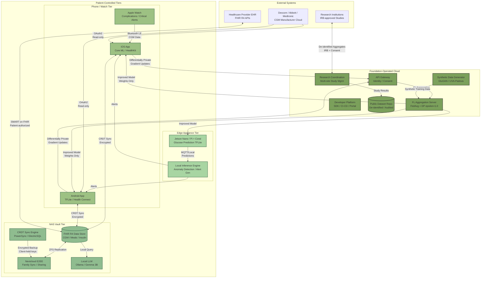

## 2. Compute Layer Strategy

The preceding market analysis established that patient trust is the single largest barrier to digital health adoption: 95% of patients are concerned about data breaches, 38% actively distrust Big Tech with health data, and 98% do not use apps to consolidate data across portals despite regulatory mandates for interoperability. These figures do not describe a market lacking technology — they describe a population that does not trust the technology already available. The compute layer strategy therefore begins from a single principle: **the architecture itself must be the trust mechanism.**

OpenDiabetic's compute strategy distributes inference, storage, and coordination across four tiers — phone/watch, edge appliance, NAS vault, and cloud — with an absolute boundary: raw patient data never leaves the user's control unless the user explicitly initiates the export. This chapter defines what OpenDiabetic operates, what runs on patient-owned hardware, and what is architecturally impossible for the foundation to access.

### 2.1 What Compute OpenDiabetic Should Own

The foundation's role is to build and maintain the services that enable a privacy-preserving diabetes ecosystem, not to become a data custodian. Three categories of compute services define this role.

**Core compute services** form the foundation's primary operational responsibility. AI inference orchestration dispatches quantized models to edge appliances and phones while managing version compatibility across TensorFlow Lite, Core ML, and ONNX Runtime runtimes. Federated learning (FL) coordination manages the global aggregation pipeline — collecting anonymized gradient updates and distributing improved models back to participants. FL for diabetes prediction achieves 91-97.27% accuracy without centralizing patient data, with the FLWCO framework reaching 97.27% [^3^] and Clu-FDL delivering precision of 0.93, recall of 0.96, and RMSE of 11.08 ± 1.77 mg/dL [^1^]. Synthetic data generation produces privacy-safe training data for underrepresented subtypes, complementing the FDA-approved UVA/Padova simulator. An API gateway provides unified authentication, while identity and consent management implements granular permission graphs.

**Infrastructure services** provide the interoperability layer. FHIR-compliant data vault interfaces enable the patient's NAS to communicate with clinical systems using HL7 FHIR R4 — turning the patient from a data subject into a data integrator [^48^]. Encrypted sync protocols based on CRDT libraries enable conflict-free offline operation with eventual encrypted cloud backup. Model evaluation harnesses continuously validate FL-trained models against standardized benchmarks before any model reaches patient devices.

**Community services** sustain ecosystem growth. The developer portal provides documentation, SDKs, and compliance tooling for third-party developers. Research credit allocation transparently attributes FL contributions to participants — addressing the incentive gap that limits real-world deployment (only 10 of 107 reviewed FL studies reported actual distributed clinical implementations) [^64^]. Care pack coordination distributes edge hardware kits to underserved communities, while the volunteer workflow platform supports the open-source diabetes community that maintains Nightscout (39,000+ members) and AndroidAPS (30,000+ users).

The rationale for foundation-owned versus patient-owned compute follows a simple decision rule: if a service requires cross-patient coordination, external institutional integration, or governance functions that no individual patient should control, it belongs to the foundation. Everything else belongs to the patient.

### 2.2 Local-First Compute Stack

The local-first compute stack places primary data storage and inference on hardware the patient owns and controls, using the cloud only for functions that genuinely require centralization. This architecture directly addresses the finding that 81% of Americans mistakenly believe health app data is HIPAA-protected [^282^] — by ensuring that even a data breach of foundation infrastructure would expose no decryptable patient information.

**NAS as personal diabetic vault.** The NAS tier serves as the authoritative data repository for each patient or household. The consumer NAS market reached USD 6.95 billion in 2025, growing at 12.18% CAGR through 2035, driven by privacy concerns and data sovereignty demands [^2^]. Entry-level Synology devices start at ~$199, QNAP offers HIPAA-compliant configurations with AI-powered drive health prediction, and TrueNAS Scale provides a free, open-source ZFS-based alternative [^4^][^5^]. The recommended stack runs Docker containers on the NAS: a FHIR R4 server (HAPI FHIR), Nextcloud with end-to-end encryption for family sharing, a local LLM endpoint (Ollama with quantized Gemma 3B/4B), and the OpenDiabetic vault application itself [^16^][^19^]. RAID 6 or ZFS RAID-Z2 tolerates any two simultaneous drive failures — essential for irreplaceable health data [^46^]. ZFS adds copy-on-write semantics, automatic checksum verification, and snapshot recovery that no cloud service can match for data integrity.

**Edge appliance tier.** The edge device handles real-time inference that requires more compute than a phone but must avoid cloud round-trip latency. NVIDIA Jetson Nano (~$99-150, 5-10W, 128-core Maxwell GPU) runs glucose prediction models via TensorFlow Lite or ONNX Runtime [^197^]. The Jetson Orin Nano ($499, 7-25W, 67 TOPS) supports models up to ~4B parameters quantized, enabling local LLM inference [^28^]. Google Coral Dev Board ($130-150, 2-4W, <50ms inference latency) offers the lowest power footprint for always-on inference [^33^]. TensorFlow Lite LSTM models on Raspberry Pi-class hardware achieve RMSE of 16 ± 4.7 mg/dL with 98.9% in Clarke Error Grid Zones A+B, with inference under 70.3 ms [^69^]. A wearable Edge-AI device using PPG sensors achieved 16.8% MAPE with 70.6% in Clarke Region A at $65 USD, requiring no network connection [^72^]. Clinical-grade glucose prediction is achievable on sub-$200 hardware entirely within the patient's home.

**Phone/watch tier.** Mobile devices serve as the primary interaction layer. Apple's Neural Engine on A18/M4-class silicon delivers inference in single-digit milliseconds, versus 300-800ms cloud round-trips on LTE [^44^]. Android TensorFlow Lite with GPU delegate achieves comparable performance on Snapdragon Hexagon NPU. Both platforms implement Apple Critical Alerts and high-priority channels for hypo/hyperglycemic events — a pathway Nightguard has demonstrated is viable [^700^]. Apple Watch complications rely on Gluroo's calendar-integration approach since native third-party complications refresh only every 15-90 minutes [^637^]. Dexcom G7's direct-to-Apple Watch connectivity is the only FDA-cleared exception to these constraints [^571^], reinforcing why HealthKit must be treated as an input source, not the primary data store.

**Sync architecture.** Local-first operation rests on a CRDT-based sync layer enabling conflict-free offline operation with eventual encrypted backup. Three mature libraries support this: Yjs (most deployed), Automerge 2.0 (Rust/WASM, full history), and Loro (emerging, best performance). Yjs applies 259,778 operations in ~1,074 ms at ~10.1 MB memory; Automerge 2.0 achieves ~1,816 ms at ~44.5 MB [^41^]. Sync engines including PowerSync (PostgreSQL to SQLite, offline writes built-in) and ElectricSQL handle intermittent connectivity [^37^]. The three-layer architecture — Zustand (UI state), IndexedDB (offline storage), encrypted IndexedDB with AES-256-GCM (sensitive data) — ensures the server sees only ciphertext [^21^].

The following table compares the four compute tiers across the dimensions that matter for diabetes management:

| Dimension | NAS / Personal Vault | Edge Appliance | Phone / Watch | Cloud (Foundation-Operated) |
|---|---|---|---|---|
| **Typical hardware** | Synology DS425+, TrueNAS Mini PC, Intel N100 [^4^] | Jetson Nano / Orin Nano, Raspberry Pi 5 + Coral [^33^] | iPhone/Android, Apple Watch Series 6+ [^571^] | AWS/Azure/GCP virtual infrastructure |
| **Primary role** | Authoritative data vault, FHIR store, family sync hub | Real-time glucose prediction, anomaly detection | Immediate inference, alerts, data capture | FL aggregation, research coordination |
| **Inference latency** | ~5-10 ms (local network) [^96^] | ~2-70 ms [^69^] | <1 ms (Core ML) [^44^] | 150-800 ms (LTE/cloud) |
| **Storage capacity** | 2-40+ TB (RAID-protected) | 64-256 GB microSD | 128 GB-1 TB (device) | Effectively unlimited |
| **Data sovereignty** | Patient owns hardware and all data | Patient owns device | Patient owns device | Foundation cannot decrypt contents |
| **Offline capability** | Full operation without internet | Full operation without internet | Full local inference without internet | Requires connectivity |
| **5-year cost per user** | $300-800 one-time [^93^] | $150-500 one-time | $0 (patient-owned phone) | ~$5-15/month foundation cost |
| **Key technology** | ZFS/RAID, Docker, Nextcloud E2EE [^13^] | TensorFlow Lite, ONNX Runtime, Jetson Inference | Core ML, TensorFlow Lite, HealthKit | Flower FL, PySyft, Kubernetes |
| **Privacy model** | Trust-No-One: server sees only ciphertext [^20^] | No data leaves the device | No data leaves the device | Zero-knowledge: encrypted at client side |

The latency-sovereignty trade-off across these tiers is shown in Figure 1. The OpenDiabetic target zone — where clinical-grade latency meets maximum data sovereignty — encompasses the NAS, edge appliance, and phone/watch tiers. Cloud compute sits outside this zone by design: it handles only coordination and aggregation tasks where latency is irrelevant but centralization is unavoidable.

*Figure 1: Compute tier trade-off — latency versus data sovereignty. Bubble size indicates relative cost efficiency. The OpenDiabetic target zone (shaded) covers the three local-first tiers where clinical-grade latency and maximum patient control intersect. Cloud infrastructure handles only coordination tasks that require centralization, with raw patient data encrypted at the client side before transmission.*

### 2.3 Cloud Tier Boundaries

The cloud tier runs only what cannot run locally. This is not a cost-saving measure — it is a privacy architecture. Every service placed in the cloud must pass a three-part test: (1) the function requires cross-patient or cross-institutional coordination that no local device can provide; (2) the function does not require access to raw patient data to perform its purpose; and (3) the function can operate under zero-knowledge constraints where the foundation cannot decrypt user vault contents even if compelled.

**Services that pass the test and run in the cloud.** The federated learning aggregation server collects encrypted model updates from participating devices, computes weighted averages, and distributes improved models back. It never sees raw glucose data — only differentially private gradient vectors that are mathematically designed to prevent reconstruction of individual contributions [^107^]. Cross-institutional research coordination enables multi-site studies where each site's local data remains under that site's control, following the EXAM study model that achieved AUC > 0.92 across 20 institutions on four continents without any patient data leaving its source location [^119^]. Public dataset hosting provides researchers with curated, fully de-identified diabetes datasets for reproducible research. Developer platform services — CI/CD, security scanning, and compliance tooling — support the open-source ecosystem that builds on OpenDiabetic infrastructure.

**What the cloud never processes.** Raw CGM data, meal logs, insulin records, and personal health journals never transit through foundation cloud infrastructure by default. Identity and authentication credentials remain on patient devices or the NAS. Family permission graphs and emergency access policies are stored in the patient's vault, not in the cloud. AI models fine-tuned on personal data remain local; only anonymized gradient updates may leave with explicit consent. This boundary is enforced cryptographically, not by policy: data is encrypted at the client side using keys that the foundation does not possess, making technical access impossible regardless of legal compulsion.

**Zero-knowledge architecture.** The zero-knowledge guarantee is implemented through a combination of client-side encryption and cryptographic key management. Each patient's vault is encrypted with a master key derived from the user's credentials — decryption happens exclusively on the user's local device, and the server (whether NAS or cloud) sees only ciphertext [^20^]. Secure data sharing uses public-key infrastructure layered over access control lists: each file is encrypted with a unique random session key, then encrypted with the recipient's public key, ensuring that only the intended recipient can decrypt [^20^]. This architecture aligns with the observation that GDPR recommends storing health data on the user's local device as a compliance strategy that "significantly reduces the risk of misuse and strengthens user trust" [^41^].

Differential privacy provides the mathematical guarantee for FL contributions. The privacy budget epsilon controls DP strength, with healthcare FL commonly using 0.01 to 10 [^66^]. At epsilon ≈ 1, noise can cause convergence failure; models maintain utility at epsilon ≈ 10 with strong pretraining [^198^]. OpenDiabetic's default pipeline uses epsilon = 1.0 with Gaussian noise and gradient clipping, configurable by task sensitivity. For especially sensitive research, homomorphic encryption (CKKS scheme) enables computation on encrypted data without decryption, achieving comparable accuracy to plaintext at 10.8x training cost — suitable for batch aggregation where latency is not critical [^192^].

The following Mermaid diagram illustrates the complete compute architecture with data flow boundaries:

*Figure 2: OpenDiabetic compute architecture. Green-shaded boxes represent patient-controlled tiers where raw data resides; darker green boxes represent foundation-operated cloud services. All patient-to-cloud data flows carry encrypted model updates only — never raw CGM, meal, or insulin data. External system integrations use OAuth2 read-only access with patient-controlled scopes.*

### 2.4 What Never Leaves the User's Control

The architecture described above is only as strong as its most fundamental guarantees. This section defines the absolute data boundaries — the categories of information that are architecturally prevented from leaving patient-controlled hardware under any circumstance, enforced through cryptography rather than policy.

Three principles govern these boundaries. **Default localism:** all data is generated, stored, and processed locally unless the user takes an explicit action to share. **Cryptographic impossibility:** the foundation cannot decrypt user vault contents because encryption keys are derived from user credentials and never transmitted to foundation servers [^20^]. **Consent as action:** sharing is not a default setting that can be toggled off — it is a positive action the user initiates for each destination, each data type, and each time period.

The following matrix defines the data boundary for each category of diabetes-relevant information:

| Data Category | Location | Can Leave With Explicit Consent? | What Leaves (if consented) | Foundation Access |
|---|---|---|---|---|
| Raw CGM readings (mg/dL, timestamps) | Device-local or NAS-local only | No — never leaves raw | N/A — sharing uses aggregated statistics only | Impossible — client-side encrypted |
| Meal logs, carb counts, photos | Device-local or NAS-local only | No — never leaves raw | Anonymized pattern summaries (e.g., "avg carbs per meal") | Impossible |
| Insulin records (doses, timing, type) | Device-local or NAS-local only | No — never leaves raw | Population-level dosing patterns with DP noise | Impossible |
| Personal health journals, notes | NAS-local with E2EE only | No | N/A — journal content never exported | Impossible |
| Identity credentials (OAuth tokens, passwords) | Device Secure Enclave / Keychain only | No — never leaves device | Nothing | Impossible |
| Family permission graphs | NAS-local encrypted vault only | No — internal to household | N/A | Impossible |
| Emergency access policies | NAS-local with 2-of-3 threshold | No — break-glass is local | N/A | Impossible |
| AI models fine-tuned on personal data | Edge device or NAS-local only | Gradient updates only | Differentially private gradient vectors (epsilon ≤ 1.0) [^107^] | Receives DP gradients only |
| FHIR R4 health records from providers | NAS-local FHIR store only | Yes — to authorized providers | Full FHIR Bundle via SMART on FHIR with user-granted scopes | No access |
| Aggregated statistics for research | Computed locally, shared optionally | Yes — to IRB-approved studies | De-identified aggregates with DP noise (epsilon = 0.1-1.0) | Coordination only |
| Model performance telemetry | Generated at device | Yes — to improve global model | Anonymized accuracy metrics, no glucose values | Receives metrics only |

The matrix reveals a clear architectural pattern: raw, identifiable health data never leaves patient-controlled hardware. What may leave — under explicit, granular, revocable consent — is either mathematically transformed to prevent reconstruction (differential privacy), aggregated beyond individual identification, or transmitted through standards-based protocols (SMART on FHIR) where the patient controls both the scope and duration of access.

**Raw CGM data, meal logs, insulin records, and personal health journals** remain device-local or NAS-local by default. These categories are most sensitive to reconstruction attacks and most valuable to data brokers. The restriction reflects both the regulatory reality that CGM data falls outside HIPAA protection when held by manufacturers [^270^] and the market reality of a $7.3 billion health data broker industry operating largely invisibly. Even de-identified CGM traces can be re-identified through temporal patterns — the foundation eliminates this risk by ensuring raw traces never reach any server it operates.

**Identity and authentication credentials, family permission graphs, and emergency access policies** are confined to patient-controlled hardware. The family permission model implements role-based access (Vault Owner > Family Member > Caregiver > Emergency Contact) with break-glass access requiring 2 of 3 trusted contacts [^26^]. Emergency policies use time-delayed release with M-of-N threshold cryptography, ensuring no single party can force access. This addresses the reality that caregivers serve as memory support and care coordinators for diabetes patients while preventing family access from becoming a surveillance vector.

**AI models fine-tuned on personal data** remain local; only anonymized gradient updates may leave with explicit consent. The FL pipeline applies differential privacy (Gaussian noise, gradient clipping, epsilon = 1.0 by default) before transmission, following the defense-in-depth approach recommended in healthcare FL reviews [^107^][^88^]. This enables the 35% improvement in glycemic excursion detection demonstrated by FedGlu across 125 patients [^145^] without exposing individual glucose history. Patients declining FL participation retain full inference capabilities — their models simply do not contribute to or receive global updates.

The zero-knowledge architecture means these boundaries hold even under legal compulsion. Because encryption keys are derived from user credentials and never transmitted to foundation servers, the foundation is technically incapable of decrypting vault contents — distinguishing OpenDiabetic from every commercial platform where the operator holds decryption capability. This structural incapacity is the technical foundation of the trust architecture that makes every other service credible to the 95% of patients concerned about breaches.

The compute strategy creates four separable investment horizons. Phase 1 (months 1-6): NAS vault and phone/watch tiers — the minimum viable sovereignty stack. Phase 2 (months 6-12): edge appliance support for real-time inference. Phase 3 (months 12-18): FL aggregation and research coordination. Phase 4 (months 18-24): developer platform and synthetic data pipeline. At every stage, patient data never leaves local control — cloud services are additive conveniences, not dependencies. The following chapter details the data ownership doctrine that makes these architectural boundaries explicit in policy as well as in code.
